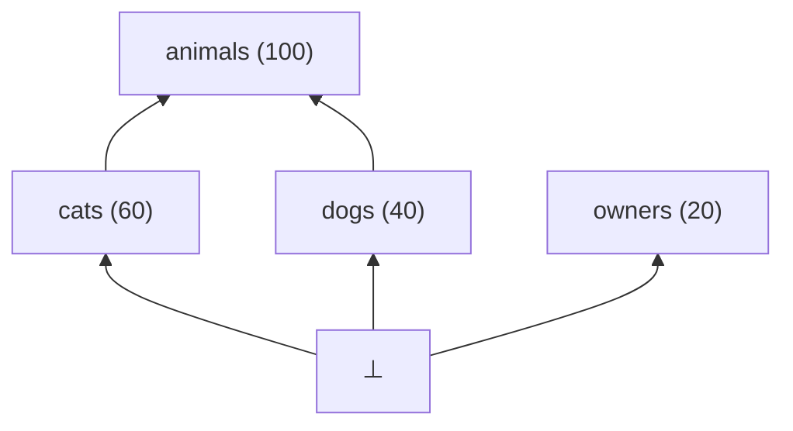
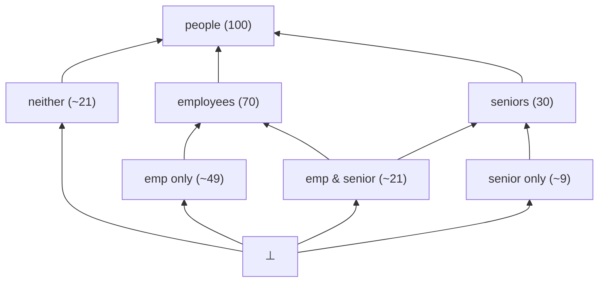
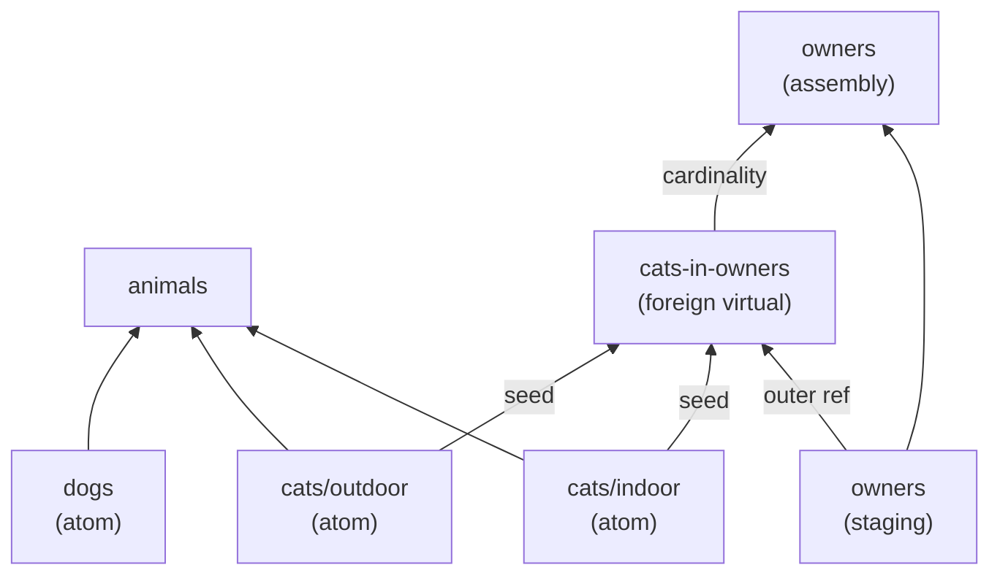

# Reframe: fakeset as a concept semi-lattice

> Terminology is drawn from order theory and partially ordered sets for the lattice structure,
> and from graph theory for the execution DAG. Bernoulli probability and IPF are standard
> references already in use elsewhere in the codebase.
>
> **Node vs element**: throughout this document, "node" and "element" are used interchangeably
> to refer to a member of the semi-lattice or DAG. "Node" is preferred when emphasising graph
> structure; "element" when emphasising order-theoretic properties.
>
> **Arrow convention (diagrams)**: arrows point from a more-constrained element toward a
> less-constrained element — i.e. from child toward parent, from ⊥ upward. This matches
> the execution-time direction for include edges. Execution edges that cross component
> boundaries (seed, outer ref, cardinality, collect) connect elements that are incomparable
> in the semi-lattice and may point in any direction.

## Worked example

The structural diagrams use the following four datasets.

```yaml
# animals.yaml
name: animals
rows: 100
data:
  - name: id
    type: string
    generator: uuid
  - name: weight_kg
    type: number
    generator: float
    min: 0.5
    max: 80.0
```

```yaml
# cats.yaml
name: cats
format: csv
output_file: cats
include:
  file: animals.yaml
  ref: animals
  ratio: 0.6
data:
  - name: environment
    type: variant
    variants:
      - value: indoor
        ratio: 0.5
      - value: outdoor
        ratio: 0.5
  - name: name
    type: string
    generator: first_name
```

```yaml
# dogs.yaml
name: dogs
format: csv
output_file: dogs
include:
  file: animals.yaml
  ref: animals
  ratio: 0.4
data:
  - name: breed
    type: string
    generator: word
```

```yaml
# owners.yaml
name: owners
format: jsonl
output_file: owners
rows: 20
links:
  - file: cats.yaml
    ref: cats
    cardinality: 2
data:
  - name: owner_id
    type: string
    generator: uuid
  - name: pets
    type: list
    content:
      group: cats
      fields:
        - name: cat_id
          refs:
            - cats.id
        - name: cat_name
          refs:
            - cats.name
```

This gives 100 animals (60 cats, 40 dogs) and 20 owners each with a `pets` list of 2 cats.

**Bernoulli factoring example** — the animals/cats/dogs datasets are mutually exclusive
(no animal is both a cat and a dog), so all cross-species Bernoulli segments are pruned.
The following pair illustrates genuine joint segments:

```yaml
# people.yaml — root, 100 rows
# employees.yaml — includes people, ratio: 0.7
# seniors.yaml   — includes people, ratio: 0.3
```

Being an employee and being a senior are independent, so all four Bernoulli segments of
`people` survive: `emp only` (~49), `emp & senior` (~21), `senior only` (~9),
`neither` (~21).

## High-level approach

The fakeset algorithm is correct and well-staged, but its conceptual framing is fragmented
across abstractions introduced incrementally: includes, content includes, pool siblings,
inner flats, prefills, collects. Each abstraction made local sense at the time but the
vocabulary doesn't immediately reveal the unified structure underneath.

Dataset definitions form a single **concept semi-lattice**: the partial order is constraint
specialisation — A ≤ B if A includes B (A is a more-constrained, narrower population).
The structure is a meet-semi-lattice: every pair of elements has a greatest lower bound
(meet, written `&`). Two elements with no include relationship (e.g. `animals` and
`owners`) meet at ⊥, the **bottom element** — the empty concept, representing a population
satisfying all constraints simultaneously, which is empty when constraints are contradictory.
With ⊥ well-defined for all pairs, the structure is one connected semi-lattice from the
outset. There is no single top element: the maximal named datasets are incomparable at the
top.

The algorithm builds an **execution DAG** from this semi-lattice by adding execution-dependency
edges for link relationships. These edges cross component boundaries and establish execution ordering between
elements that are incomparable in the semi-lattice. Topological sort of the DAG gives
execution order.

The algorithm has two symmetric phases:
1. **Push down** — field definitions, type constraints, and ref bindings propagate toward
   the most-constrained leaf nodes (atoms).
2. **Accumulate up** — generated values propagate upward toward parent nodes.

**Row count estimation** follows the same semi-lattice recursively: every non-maximal element
derives its row count from its parent — `parent.rows × ratio` for include children,
`source.rows × cardinality` for foreign virtual nodes. Row counts are resolved bottom-up
from declared values on root elements before generation begins.

**Atoms** are elements that cover ⊥ directly — the most-constrained nodes in the expanded
semi-lattice. Atoms are generated first; everything above them is assembled from their output.

## Planning

Planning transforms YAML definitions into an execution DAG via six steps.

### Step 1 — Build the initial semi-lattice

Read all YAML files. Each dataset becomes an element. The `include` stanza on a dataset
induces the partial order: if A includes B then A ≤ B (A is more constrained than B).

Named datasets that share no include relationships are incomparable elements whose meet
is ⊥. They are members of the same semi-lattice — ⊥ connects everything at the bottom.

**Row count at this step:** Each element's row count is declared via `rows:`, or derived
recursively as `parent.rows × ratio`, bottom-up from root declarations.

### Step 2 — Expand variants

Elements with `type: variant` fields are expanded. A dataset with N declared values on a
single variant field is replaced by N new elements at the same position in the semi-lattice
(same include edges; the original is removed). For multiple independent variant fields of
sizes n₁, n₂, …, the expansion is the cross-product ∏nᵢ.

Row fractions are proportional to variant `ratio` fields. This is a flat ∏nᵢ split — the
combinatorial expansion from Bernoulli factoring over lower-cover elements comes in Step 4.

In the worked example, `cats` expands to `cats/indoor` (30 rows) and `cats/outdoor`
(30 rows), both at the same semi-lattice position as the original.

### Step 3 — Decompose link relationships

A **link relationship** is declared via a `links:` stanza. The declaring dataset is the
**source dataset**; the stanza's target is the **linked dataset**. A link relationship
serves one or both purposes:

- **List generation**: a `content: {group: <ref>}` list field produces a list column in
  the source dataset, populated with rows drawn from the linked dataset.
- **Collect binding**: a `bind: X, reducer: collect` ref binding accumulates values from
  generated cross-rows back into fields of the linked dataset.

Each link relationship introduces the following nodes:

**Staging node** (in the source dataset's include component): the source dataset is split.
The staging node generates all non-list fields of the source dataset and does not emit
output. It exists so that outer-scoped field values are materialised and indexed by
`_slot_idx` before the foreign virtual node reads them.

**Foreign virtual node**: an atom in the semi-lattice — it covers ⊥ directly and is
incomparable to all elements in both the source and linked include components. There are
no lattice ordering edges between it and those components; all cross-component connections
are execution edges added in Step 6. It generates one row per (source-row, linked-row)
pairing, and these rows form the **inner flat**.

> **Inner flat**: the intermediate flat table of all cross-rows, before folding or
> accumulation. One row per pairing, keyed by `_slot_idx` (which source row this pairing
> belongs to) and `_linked_idx` (which linked-dataset row was drawn). For list generation,
> the assembly node folds this into list columns by grouping on `_slot_idx`. For collect
> bindings, this table is the source of values accumulated back into linked-dataset fields.

Because the foreign virtual node has no lattice ordering edges to either component, it
does not participate in Bernoulli factoring in Step 4 via the include hierarchy. Its
generation draws from the segmented atoms of the linked hierarchy (via seed edges in
Step 6), preserving the linked hierarchy's segmentation structure in the inner flat's
inherited fields.

**Assembly node** (for link relationships with list fields): sits above the staging node
in the include ordering of the source component. After the inner-flat rows are generated,
it folds them into list columns by grouping on `_slot_idx`, evaluates expressions, and
emits the source dataset's final output. For collect-only links (no list field), the
assembly node may be omitted; the staging node becomes the full generation step.

The staging/assembly split is necessary because the foreign virtual node sits between
them in execution order: the staging node must run first (outer-scoped refs), then the
foreign virtual node (draws from both staging and linked dataset atoms), then the assembly
node (folds the inner flat).

> **Note:** virtual nodes are added before Bernoulli factoring (Step 4) so that row-count
> estimation across components is correct from that point forward.

### Step 4 — Bernoulli factoring (joint distribution nodes)

Every node with two or more elements in its lower cover (the set of elements that directly
include it) is subject to joint distribution expansion:

1. **Enumerate segments**: form all 2^N subsets of the lower cover. Each subset is a
   segment — rows of the parent belonging to exactly those lower-cover elements and no
   others. Each segment becomes a new element of the semi-lattice.
2. **Product-Bernoulli weights**: assign each segment a prior weight equal to the product
   of marginal in/out probabilities for each lower-cover element.
3. **Constraint conflict pruning**: zero out any segment whose combined field constraints
   are mutually unsatisfiable (meet = ⊥). Redistribute the zeroed weight to surviving
   segments proportionally.
4. **IPF reweighting**: scale surviving weights so declared marginal ratios are exactly
   restored.
5. **Rounding**: for segments with a fractional row count, the correct approach is to
   include a single row with probability equal to the fractional weight (Bernoulli sampling
   at the segment level) rather than deterministic zeroing. Pruning zero-weight segments
   after this step is the primary mechanism keeping 2^N enumeration tractable.

After expansion, the segment nodes become the new lower cover of the parent. The process
is applied recursively.

In the people/employees/seniors example: lower cover {employees, seniors} produces four
segments; none are pruned. After IPF: employees marginal = 70, seniors marginal = 30.

In the animals example: lower cover {cats/indoor, cats/outdoor, dogs} produces 8 segments.
All cross-species and cross-variant combinations are pruned. Since ratios sum to 1.0, the
remainder is also zero. The three surviving segment nodes are identical to the original
lower-cover elements — in this degenerate case the lower-cover elements ARE the atoms.

### Step 5 — Mark atoms

An atom is a least element strictly greater than ⊥ — an element that covers ⊥ directly.
After Step 4, atoms are:
- Remainder segment nodes (parent rows not covered by any lower-cover element)
- Segment nodes covering exactly one combination of lower-cover constraints, including
  fully-combined joint nodes (A & B & C & …)
- Any lower-cover element whose only lower-cover element is ⊥ (the degenerate case)
- Foreign virtual nodes (they cover ⊥ by construction — Step 3)

At this stage — before the execution edges added in Step 6 — atoms within an include
component are independent of each other. Step 6 introduces cross-component seed edges
that constrain the achievable execution parallelism. A library-level DAG scheduler is the
preferred path for exploiting available parallelism.

### Step 6 — Add execution edges (DAG formation)

The semi-lattice captures constraint narrowing but not the execution dependencies
introduced by link relationships. Four types of execution edge are added:

**Seed edge**: from each atom of the linked dataset (the segment-level nodes produced by
Steps 4–5, not individual data rows) to the foreign virtual node. Ensures the full linked
batch is generated before inner-flat generation begins. The foreign virtual node and the
linked dataset's atoms are in different include components and therefore incomparable in
the semi-lattice; the seed edge establishes execution ordering between them.

**Outer ref edge**: from the staging node to the foreign virtual node. Ensures the source
dataset's non-list fields are materialised before the foreign virtual node reads outer-scoped
ref values from them.

**Cardinality edge**: from the foreign virtual node to the assembly node. Ensures the
inner-flat batch is complete before the assembly node folds it into list columns.

**Collect edge**: from the foreign virtual node to the linked dataset's emit step. When
the link relationship includes collect bindings, ensures accumulation into linked-dataset
fields fires before the linked dataset writes its output.

Topological sort of the resulting DAG gives execution order.

**Link edges and the ordering relation.** Adding execution edges does not modify the
semi-lattice ordering — the partial order is defined entirely by include relationships.
The meet (⊓) therefore remains well-defined only for elements connected by include edges.
Two elements whose only connection is an execution edge have no meaningful meet beyond ⊥.
Seed and outer-ref edges may run in a direction that contradicts what the lattice ordering
would imply for execution; this is expected and correct — the execution DAG is a
superset of the lattice structure, not a subgraph of it.

## Diagrams

Diagrams 1–3 are **lattice diagrams**: they show the semi-lattice structure (include
ordering) with ⊥ at the bottom. Diagram 4 is a **DAG diagram**: it shows execution
dependencies and omits ⊥. Solid arrows are ordering (include) edges. Dashed arrows are
execution edges.

### Diagram 1 — Initial semi-lattice (after Step 1)



`cats`, `dogs`, and `owners` are atoms at this stage (each covers ⊥ directly). `animals`
and `owners` are incomparable; their meet is ⊥.

### Diagram 2 — After variant expansion and link decomposition (after Steps 2–3)


`cats` is replaced by `cats/indoor` and `cats/outdoor`. `owners` splits into a staging
node and an assembly node. The foreign virtual node `cats-in-owners` is an atom (solid
edge from ⊥), incomparable to all other elements — it has no solid lattice edges to the
cats or owners components. All cross-component connections are execution edges (dashed).

### Diagram 3 — After Bernoulli factoring (after Step 4)

Uses the `people` / `employees` / `seniors` example to show genuine joint segments.



Four atoms cover ⊥ directly. `employees` and `seniors` are intermediate nodes covered by
two atoms each. `emp & senior` is the genuine joint node produced by Bernoulli factoring.

In the animals example, cats/indoor, cats/outdoor, and dogs become their own atoms
directly (the degenerate case — no separate segment nodes are created). The foreign
virtual node `cats-in-owners` remains an atom at ⊥ throughout all steps.

### Diagram 4 — Execution DAG (after Step 6, animals example)



No ⊥ in DAG diagrams. `cats/indoor` and `cats/outdoor` both emit to the same `cats.csv`
output (a shared-output union step above both atoms, omitted here for clarity). The seed
edges and outer-ref edge establish execution ordering between elements that are
incomparable in the semi-lattice (different include components).

## Execution

Execution traverses the DAG in topological order.

### Phase 1 — Generate atoms (leaf-first)

For each atom node in topological order:
- **Segment atoms**: generate rows using field generators and local constraints. No prefill
  from above — field definitions were pushed down during planning. Each row carries
  `_slot_idx` (source row index) and `_linked_idx` (linked-dataset row index).
- **Foreign virtual nodes**: draw field values from the staging node's batch (outer-scoped
  refs, via `_slot_idx`) and from the linked dataset's generated rows (via `_linked_idx`).
  Seed and outer-ref edges guarantee both sources are available.

Collect bindings fire after the inner-flat batch completes (collect edge ensures ordering).

### Phase 2 — Accumulate upward (child-first, parent-last)

For each non-atom node in topological order:
- **Prefill accumulation**: LEFT JOIN on `_row_idx` from each child batch. Fields present
  in a child are inherited; remaining fields are generated fresh.
- **List assembly**: for assembly nodes, the inner-flat batch is folded into list columns
  by grouping on `_slot_idx`.
- **Expression evaluation**: after all inherited fields are present.
- **Filter hidden fields**: strip `hidden: true` fields before emitting.
- **Emit**: write to output file (CSV/Parquet/JSONL/JSON).

Within a component, all atoms are generated before any accumulation. A component completes
both phases before any downstream component starts.

## Glossary

| Term | Definition |
|------|------------|
| **⊥ (bottom)** | Greatest lower bound of all elements: the empty concept. Unsatisfiable Bernoulli segments reduce to ⊥ and are pruned. |
| **Atom** | An element covering ⊥ directly: a least element strictly greater than ⊥. Atoms generate rows from scratch with no prefill. |
| **Assembly node** | Virtual node (Step 3) above the staging node. Folds the inner-flat into list columns, evaluates expressions, and emits the source dataset's output. |
| **Cardinality edge** | Execution edge from a foreign virtual node to an assembly node. Ensures the inner-flat batch is complete before list assembly. |
| **Collect edge** | Execution edge from a foreign virtual node to the linked dataset's emit step. Ensures collect/reduce accumulation fires before the linked dataset writes output. |
| **Foreign virtual node** | An atom (covers ⊥) created per link relationship. Incomparable to all elements in both the source and linked include components; connected to them only via execution edges. Generates the inner-flat batch: one row per (source-row, linked-row) pairing. |
| **Inner flat** | The intermediate flat table produced by a foreign virtual node. One row per cross-row pairing, keyed by `_slot_idx` and `_linked_idx`. |
| **Inheritance** | A ≤ B if A's dataset definition includes B. A inherits B's field definitions. |
| **Linked dataset** | The target dataset in a `links:` stanza. Its generated rows are drawn from by the foreign virtual node. |
| **Lower cover** | The set of immediate predecessors of an element: the elements it directly includes. |
| **Meet (⊓ or &)** | Greatest lower bound. For lower-cover siblings, meet(A, B) is the most-constrained segment satisfying both sets of constraints. The formal underpinning of Bernoulli factoring. |
| **Outer ref edge** | Execution edge from the staging node to the foreign virtual node. Ensures the source dataset's non-list fields are available before inner-flat generation. |
| **Remainder segment** | The segment for rows of a parent not covered by any lower-cover element. |
| **Seed edge** | Execution edge from each atom of the linked dataset to the foreign virtual node. Ensures the full linked batch is generated before inner-flat generation begins. |
| **Segment node** | A node created by Bernoulli factoring: represents rows belonging to exactly a specified subset of lower-cover elements. |
| **Source dataset** | The dataset declaring a `links:` stanza. |
| **Staging node** | Virtual node (Step 3) created by splitting the source dataset. Generates non-list fields and does not emit. Provides outer-scoped field values (via `_slot_idx`) to the foreign virtual node. |

## Concept map

| YAML feature | Semi-lattice concept | Notes |
|---|---|---|
| `include: {file: X}` | Partial order: A ≤ B | One include per dataset |
| `ratio:` on include | Marginal probability for Bernoulli factoring | |
| `rows:` | Declared row count for root elements | |
| Multiple datasets sharing a parent | Lower cover of the parent node | |
| `type: variant` field | Horizontal expansion into ∏nᵢ elements | |
| `links:` stanza | Link relationship → staging + foreign virtual + assembly | |
| `content: {group: <ref>}` | List generation: inner flat folded by assembly node | |
| `bind: X, reducer: collect` | Collect edge; accumulates inner-flat values into linked dataset | |
| `content: {project: "<ref>.<field>"}` | Projection from inner flat to scalar list | |
| `hidden: true` | Participates in constraint resolution; stripped before emit | |
| Bernoulli segment enumeration | 2^N elements forming the new lower cover | |
| Constraint conflict pruning | Pruning segment nodes that reduce to ⊥ | |
| IPF reweighting | Restoring marginal ratios after pruning | |
| `_slot_idx` sentinel | Source-row index: which source row each inner-flat row belongs to | |
| `_linked_idx` (formerly `_pool_idx`) | Linked-row index: which linked-dataset row was drawn | |
| Prefill / field inheritance | Accumulate upward: inherit child column into parent batch | |

## Terminological changes

| Current term | Proposed term | Rationale |
|---|---|---|
| sibling | lower cover element | More precise. |
| sibling group | parent + lower cover | The unit of Bernoulli factoring. |
| sibling set | lower cover | Exact order-theoretic term. |
| nested include / rich list | list-link field | Names the YAML feature. |
| inner flat | inner-flat table | The intermediate table from a foreign virtual node. |
| prefill | inherited field | Emphasises the accumulate-up direction. |
| pool sibling | foreign virtual node | Precise name for the atom introduced in Step 3. |
| pool / pool slot | linked batch / linked row | Removes implementation-specific naming. |
| `_pool_idx` | `_linked_idx` | Consistent with "linked row". |
| scalar node / partial node | staging node | Stages outer data before inner-flat generation. |
| include chain | include component | A maximal include-connected subgraph. |
| `includes` → `include` | ✓ done in MULT-1 | One include per dataset. |
| `distribution` → `ratio` | ✓ done in MULT-1 | Consistent with probability framing. |

## Existing alignment

| Current implementation | New concept | Notes |
|---|---|---|
| `build_dag` + topo sort | Semi-lattice construction + execution order | Already correct |
| `plan_segments` (Bernoulli, IPF, pruning) | Steps 4–5 | Core algorithm unchanged |
| `grow_parent_from_children` | Phase 2 prefill accumulation | Already a LEFT JOIN on `_row_idx` |
| `filter_hidden_columns` | Hidden field stripping | |
| `evaluate_expressions` | Expression evaluation in Phase 2 | |
| `_slot_idx` sentinel | Source-row index | Clean mapping |
| `_pool_idx` sentinel | Linked-row index (`_linked_idx`) | Rename only |
| `CollectToPool` step | Collect edge semantics | |
| `GenerateDataset(skip_emit=true)` | Staging node | Rename needed |
| `AssembleNestedInclude` | Assembly node | Rename needed |
| `GenerateInnerFlat` | Foreign virtual node execution | Rename needed |

## Gap analysis

**Naming gaps (low effort)**
- `sibling`, `sibling group`, `pool sibling` → lower cover vocabulary.
- `GenerateInnerFlat`, `AssembleNestedInclude`, `GenerateDataset(skip_emit=true)` →
  staging node, foreign virtual node, assembly node naming.
- `_pool_idx` → `_linked_idx`.

**Structural gaps (higher effort)**
- **One foreign node per link vs one per segment**: current implementation creates one
  `GenerateInnerFlat` per list-link field. Confirm whether the foreign virtual node should
  be replicated per segment of the linked dataset to correctly inherit segment-level
  constraints (see Things to Clarify #1).
- **Foreign virtual node as an explicit lattice + DAG element**: currently the three-node
  structure (staging, foreign virtual, assembly) is implicit in the plan step ordering.
  Making it explicit would enable cleaner passes and lattice-aware expression evaluation.
- **Outer ref edge**: currently implicit (`GenerateInnerFlat` reads from
  `computed[outer_path]`). An explicit outer ref edge in the DAG would make this
  dependency visible and verifiable.

## Things to clarify

1. **Foreign node per segment vs per link.** The correct framing may be one foreign virtual
   node per segment of the linked dataset, so each correctly inherits segment-level field
   constraints. Current implementation: one per link field. Confirm whether this is a
   correctness issue.

2. **Probabilistic single-row rounding.** Confirmed: for segments with fractional row
   count, include a single row with probability equal to the fractional weight. This should
   replace the current deterministic rounding logic.

3. **Parallelism.** Atoms are independent within a component before seed edges. A DAG
   scheduler (e.g. DataFusion or Rayon) is the preferred path for exploiting this.

4. **`_slot_idx` with multiple list-link fields.** When a source dataset has two distinct
   list-link fields, there are two foreign virtual nodes keying into the same `_slot_idx`.
   Confirm the executor handles multiple inner-flat batches and assembles them correctly
   into separate list columns.

5. **Row-count estimation for foreign virtual nodes with segmented linked datasets.**
   Currently `source.rows × cardinality`. If the linked dataset has multiple segments,
   per-segment eligibility may need to be accounted for.
