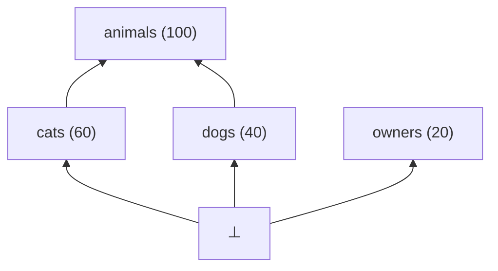
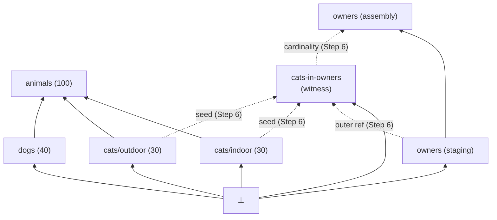
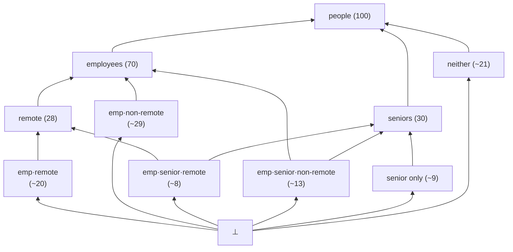
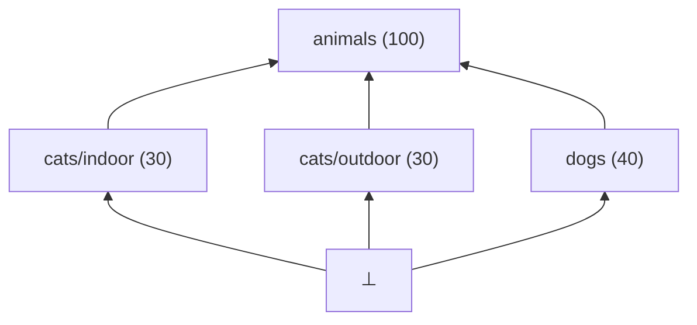
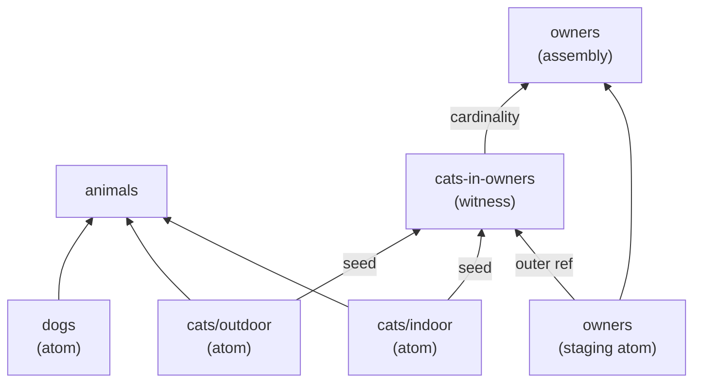

# Reframe: fakeset as a concept semi-lattice

> Terminology is drawn from order theory and partially ordered sets for the lattice structure,
> and from graph theory for the execution DAG. Bernoulli probability and IPF are standard
> references already in use elsewhere in the codebase.
>
> **Node vs element**: throughout this document, "node" and "element" are used interchangeably
> to refer to a member of the semi-lattice or DAG. "Node" is preferred when emphasising graph
> structure; "element" when emphasising order-theoretic properties.
>
> **Arrow convention (diagrams)**: arrows point from a more-constrained element toward a
> less-constrained element — i.e. from child toward parent, from ⊥ upward. This matches
> the execution-time direction for include edges. Execution edges that cross component
> boundaries (seed, outer ref, cardinality, collect) connect elements that are incomparable
> in the semi-lattice and may point in any direction.

## Worked example

The structural diagrams use the following four datasets.

```yaml
# animals.yaml
name: animals
rows: 100
data:
  - name: id
    type: string
    generator: uuid
  - name: weight_kg
    type: number
    generator: float
    min: 0.5
    max: 80.0
```

```yaml
# cats.yaml
name: cats
format: csv
output_file: cats
include:
  file: animals.yaml
  ref: animals
  ratio: 0.6
data:
  - name: environment
    type: variant
    variants:
      - value: indoor
        ratio: 0.5
      - value: outdoor
        ratio: 0.5
  - name: name
    type: string
    generator: first_name
```

```yaml
# dogs.yaml
name: dogs
format: csv
output_file: dogs
include:
  file: animals.yaml
  ref: animals
  ratio: 0.4
data:
  - name: breed
    type: string
    generator: word
```

```yaml
# owners.yaml
name: owners
format: jsonl
output_file: owners
rows: 20
links:
  - file: cats.yaml
    ref: cats
    cardinality: 2
data:
  - name: owner_id
    type: string
    generator: uuid
  - name: pets
    type: list
    content:
      from: cats
      fields:
        - name: cat_id
          refs:
            - cats.id
        - name: cat_name
          refs:
            - cats.name
```

This gives 100 animals (60 cats, 40 dogs) and 20 owners each with a `pets` list of 2 cats.

**Bernoulli factoring example** — the animals/cats/dogs datasets are mutually exclusive
(no animal is both a cat and a dog), so all cross-species Bernoulli segments are pruned.
The following pair illustrates genuine joint segments:

```yaml
# people.yaml — root, 100 rows
# employees.yaml — includes people, ratio: 0.7
# seniors.yaml   — includes people, ratio: 0.3
```

Being an employee and being a senior are independent, so all four Bernoulli segments of
`people` survive: `emp only` (~49), `emp & senior` (~21), `senior only` (~9),
`neither` (~21).

## High-level approach

The fakeset algorithm is correct and well-staged, but its conceptual framing is fragmented
across abstractions introduced incrementally: includes, content includes, pool siblings,
inner flats, prefills, collects. Each abstraction made local sense at the time but the
vocabulary doesn't immediately reveal the unified structure underneath.

Dataset definitions form a single **concept semi-lattice**: the partial order is constraint
specialisation — A ≤ B if A includes B (A is a more-constrained, narrower population).
The structure is a meet-semi-lattice: every pair of elements has a greatest lower bound
(meet, written `&`). Two elements with no include relationship (e.g. `animals` and
`owners`) meet at ⊥, the **bottom element** — the empty concept, representing a population
satisfying all constraints simultaneously, which is empty when constraints are contradictory.
With ⊥ well-defined for all pairs, the structure is one connected semi-lattice from the
outset. There is no single top element: the maximal named datasets are incomparable at the
top.

The algorithm builds an **execution DAG** from this semi-lattice by adding execution-dependency
edges for link relationships. These edges cross component boundaries and establish execution ordering between
elements that are incomparable in the semi-lattice. Topological sort of the DAG gives
execution order.

The algorithm has two symmetric phases:
1. **Push down** — field definitions, type constraints, and ref bindings propagate toward
   the most-constrained leaf nodes (atoms).
2. **Accumulate up** — generated values propagate upward toward parent nodes.

**Row count estimation** follows the same semi-lattice recursively: every non-maximal element
derives its row count from its parent — `parent.rows × ratio` for include children,
`source.rows × cardinality` for witness nodes. Row counts are resolved bottom-up
from declared values on root elements before generation begins.

**Atoms** are elements that cover ⊥ directly — the most-constrained nodes in the expanded
semi-lattice. Atoms are generated first; everything above them is assembled from their output.

## Planning

Planning transforms YAML definitions into an execution DAG via six steps.

### Step 1 — Build the initial semi-lattice

Read all YAML files. Each dataset becomes an element. The `include` stanza on a dataset
induces the partial order: if A includes B then A ≤ B (A is more constrained than B).

Named datasets that share no include relationships are incomparable elements whose meet
is ⊥. They are members of the same semi-lattice — ⊥ connects everything at the bottom.

**Row count at this step:** Each element's row count is declared via `rows:`, or derived
recursively as `parent.rows × ratio`, bottom-up from root declarations.

### Step 2 — Expand variants

Elements with `type: variant` fields are expanded. A dataset with N declared values on a
single variant field is replaced by N new elements at the same position in the semi-lattice
(same include edges; the original is removed). For multiple independent variant fields of
sizes n₁, n₂, …, the expansion is the cross-product ∏nᵢ.

Row fractions are proportional to variant `ratio` fields. This is a flat ∏nᵢ split — the
combinatorial expansion from Bernoulli factoring over lower-cover elements comes in Step 4.

In the worked example, `cats` expands to `cats/indoor` (30 rows) and `cats/outdoor`
(30 rows), both at the same semi-lattice position as the original.

### Step 3 — Decompose link relationships

A **link relationship** is declared via a `links:` stanza. The declaring dataset is the
**source dataset**; the stanza's target is the **linked dataset**. A link relationship
serves one or both purposes:

- **List generation**: a `content: {from: <ref>}` list field produces a list column in
  the source dataset, populated with rows drawn from the linked dataset.
- **Collect binding**: a `bind: X, reducer: <reducer>` ref binding accumulates values from
  generated cross-rows back into fields of the linked dataset. Supported reducers include
  `collect` (gather all values as a list), `max`, `min`, `sum`, and similar aggregates.

Each link relationship introduces three nodes:

**Staging node** (in the source dataset's include component): the source dataset is split.
The staging node generates all non-list fields of the source dataset and does not emit
output. It exists so that outer-scoped field values are materialised and indexed by
`_slot_idx` before the witness node reads them.

**Witness node**: an atom in the semi-lattice — it covers ⊥ directly and is incomparable
to all elements in both the source and linked include components. There are no lattice
ordering edges between it and those components; all cross-component connections are
execution edges added in Step 6. The witness node has the **linked dataset's schema**: its
fields are those of the linked dataset as drawn. It also carries one hidden column,
`_staging_refs`, which is a list of source-slot indices — recording which staging rows
drew this particular linked row. When the same linked row is drawn by multiple source
slots, all those slot indices accumulate in one `_staging_refs` list on a single witness
row, giving one witness row per unique linked-row draw with `_staging_refs` encoding the
full many-to-one pairing.

The witness node does not participate in Bernoulli factoring — it has no lattice ordering
edges and is incomparable to everything. It is the **staging node** that participates in
source-component Bernoulli factoring (Step 4), and this induces witness replication as a
consequence: each staging segment atom gets its own paired witness node via the outer-ref
edge. The (staging, witness) pair is the replicating unit. If owners factors into seniors
and non-seniors, the result is {seniors-staging + cats-in-seniors-owners witness} and
{non-seniors-staging + cats-in-non-seniors-owners witness}. Both witness nodes still cover
⊥ directly and remain incomparable to all elements in both include components. Per-segment
replication is a correctness requirement: a single unified witness node cannot apply
source-segment-specific constraints to linked-dataset selection (e.g. senior owners
drawing preferentially from indoor cats).

**Assembly node** (for link relationships with list fields): sits above the staging node
in the include ordering of the source component. After the witness batch is generated, it
groups witness rows by `_staging_refs` entry to reconstruct the per-source-slot pairings,
assembles list columns, evaluates expressions, and emits the source dataset's final output.
For collect-only links (no list field), the assembly node may be omitted; the staging node
becomes the full generation step.

The staging/witness/assembly ordering is necessary because the witness node sits between
them in execution order: the staging node must run first (outer-scoped refs), then the
witness node (draws from both staging and linked dataset atoms), then the assembly node
(groups by `_staging_refs`).

**Multiple links.** A source dataset may declare multiple `links:` stanzas. Each produces
an independent (staging atom, witness, assembly) triple drawing from its respective linked
dataset. The staging atom is shared across all link relationships on the same source
dataset — all witness nodes for that source read from the same staging batch via
`_staging_refs`. Witness node names must be unique; otherwise the three-node structure is
fully independent per link and there is no conflict between them.

> **Note:** witness nodes are added before Bernoulli factoring (Step 4) so that row-count
> estimation across components is correct from that point forward.

### Step 4 — Bernoulli factoring (joint distribution nodes)

Every node with two or more elements in its lower cover (the set of elements that directly
include it) is subject to joint distribution expansion:

1. **Enumerate segments**: form all 2^N subsets of the lower cover. Each subset is a
   segment — rows of the parent belonging to exactly those lower-cover elements and no
   others. Each segment becomes a new element of the semi-lattice.
2. **Product-Bernoulli weights**: assign each segment a prior weight equal to the product
   of marginal in/out probabilities for each lower-cover element.
3. **Constraint conflict pruning**: zero out any segment whose combined field constraints
   are mutually unsatisfiable (meet = ⊥). Redistribute the zeroed weight to surviving
   segments proportionally.
4. **IPF reweighting**: scale surviving weights so declared marginal ratios are exactly
   restored.
5. **Rounding**: for segments with a fractional row count, the correct approach is to
   include a single row with probability equal to the fractional weight (Bernoulli sampling
   at the segment level) rather than deterministic zeroing. Pruning zero-weight segments
   after this step is the primary mechanism keeping 2^N enumeration tractable.

After expansion, the segment nodes become the new lower cover of the parent. The process
is applied recursively.

In the people/employees/seniors example: lower cover {employees, seniors} produces four
segments; none are pruned. After IPF: employees marginal = 70, seniors marginal = 30.

In the animals example: lower cover {cats/indoor, cats/outdoor, dogs} produces 8 segments.
All cross-species and cross-variant combinations are pruned. Since ratios sum to 1.0, the
remainder is also zero. The three surviving segment nodes are identical to the original
lower-cover elements — in this degenerate case the lower-cover elements ARE the atoms.

### Step 5 — Mark atoms

An atom is a least element strictly greater than ⊥ — an element that covers ⊥ directly.
After Step 4, atoms are:
- Remainder segment nodes (parent rows not covered by any lower-cover element)
- Segment nodes covering exactly one combination of lower-cover constraints, including
  fully-combined joint nodes (A & B & C & …)
- Any lower-cover element whose only lower-cover element is ⊥ (the degenerate case)
- Witness nodes (they cover ⊥ by construction — Step 3)

At this stage — before the execution edges added in Step 6 — atoms within an include
component are independent of each other. Step 6 introduces cross-component seed edges
that constrain the achievable execution parallelism. A library-level DAG scheduler is the
preferred path for exploiting available parallelism.

### Step 6 — Add execution edges (DAG formation)

The semi-lattice captures constraint narrowing but not the execution dependencies
introduced by link relationships. Four types of execution edge are added:

**Seed edge**: from each atom of the linked dataset (the segment-level nodes produced by
Steps 4–5, not individual data rows) to the witness node. Ensures the full linked
batch is generated before witness generation begins. The witness node and the
linked dataset's atoms are in different include components and therefore incomparable in
the semi-lattice; the seed edge establishes execution ordering between them.

**Outer ref edge**: from the staging node to the witness node. Ensures the source
dataset's non-list fields are materialised before the witness node reads outer-scoped
ref values from them.

**Cardinality edge**: from the witness node to the assembly node. Ensures the
witness batch is complete before the assembly node groups and folds it.

**Collect edge**: from the witness node to the linked dataset's emit step. When
the link relationship includes collect bindings, ensures accumulation into linked-dataset
fields fires before the linked dataset writes its output.

Topological sort of the resulting DAG gives execution order.

**Link edges and the ordering relation.** Adding execution edges does not modify the
semi-lattice ordering — the partial order is defined entirely by include relationships.
The meet (⊓) therefore remains well-defined only for elements connected by include edges.
Two elements whose only connection is an execution edge have no meaningful meet beyond ⊥.
Seed and outer-ref edges may run in a direction that contradicts what the lattice ordering
would imply for execution; this is expected and correct — the execution DAG is a
superset of the lattice structure, not a subgraph of it.

## Diagrams

Diagrams 1–3 are **lattice diagrams**: they show the semi-lattice structure (include
ordering) with ⊥ at the bottom. Diagram 4 is a **DAG diagram**: it shows execution
dependencies and omits ⊥. Solid arrows are ordering (include) edges. Dashed arrows are
execution edges.

### Diagram 1 — Initial semi-lattice (after Step 1)



`cats`, `dogs`, and `owners` are atoms at this stage (each covers ⊥ directly). `animals`
and `owners` are incomparable; their meet is ⊥.

### Diagram 2 — After variant expansion and link decomposition (after Steps 2–3)



`cats` is replaced by `cats/indoor` and `cats/outdoor`. `owners` splits into a staging
node and an assembly node. The witness node `cats-in-owners` is an atom (solid edge from
⊥), incomparable to all other elements — it has no solid lattice edges to the cats or
owners components. All cross-component connections are execution edges (dashed).

### Diagram 3A — After Bernoulli factoring: genuine joint segments with recursive factoring

This diagram extends the people/employees/seniors example by adding `remote` (includes
`employees`, ratio 0.4, 28 rows), illustrating how Bernoulli factoring applies recursively
when an intermediate node itself has a lower cover.



Six atoms cover ⊥ directly. Bernoulli factoring at the `people` level produces four
population segments ({employees, seniors}); factoring at the `employees` level splits those
into remote and non-remote sub-variants. `remote` is an intermediate node (covered by two
atoms); `employees` and `seniors` are intermediate nodes above them; `people` is the root.
The four emp-related atoms each carry the intersection of their people-level and
employees-level segment constraints. Bernoulli factoring is applied recursively bottom-up:
each node with a non-empty lower cover is expanded before its parent is considered.

### Diagram 3B — After Bernoulli factoring: degenerate case (animals example)



In the animals example, all cross-species and cross-variant Bernoulli segments are pruned
(mutually exclusive field constraints), and ratios sum to 1.0 so the remainder is zero.
The surviving segments are identical to the original lower-cover elements: `cats/indoor`,
`cats/outdoor`, and `dogs` become their own atoms directly — the lower-cover elements ARE
the atoms. No intermediate segment nodes exist between them and ⊥. This degenerate case
is common when include siblings partition the parent population cleanly.

### Diagram 4 — Execution DAG (after Step 6, animals example)



No ⊥ in DAG diagrams. `cats/indoor` and `cats/outdoor` both emit to the same `cats.csv`
output (a shared-output union step above both atoms, omitted here for clarity). The seed
edges and outer-ref edge establish execution ordering between elements that are
incomparable in the semi-lattice (different include components).

## Execution

Execution traverses the DAG in topological order.

### Phase 1 — Generate atoms (leaf-first)

For each atom node in topological order:
- **Segment atoms**: generate rows using field generators and local constraints. No prefill
  from above — field definitions were pushed down during planning. Staging atoms (source
  component) additionally carry `_slot_idx` to index source rows for the witness node.
- **Witness nodes**: for each unique linked row drawn (across all source slots), generate
  one witness row carrying the linked dataset's fields and a `_staging_refs` list of all
  source-slot indices that drew this linked row. Seed and outer-ref edges guarantee both
  the linked batch and the staging batch are available.

Collect bindings fire after the witness batch is complete (collect edge ensures ordering).

When a linked dataset itself has a `links:` stanza (chained links), it is also split into
staging/witness/assembly nodes. Topological sort handles the ordering naturally: innermost
linked atoms are generated first, their witness batches complete and collect bindings fire,
their assembly nodes emit — all before the outer witness node's seed edge is satisfied.

### Phase 2 — Accumulate upward (child-first, parent-last)

For each non-atom node in topological order:
- **Prefill accumulation**: LEFT JOIN on `_row_idx` from each child batch. Fields present
  in a child are inherited; remaining fields are generated fresh.
- **List assembly**: for assembly nodes, witness rows are grouped by `_staging_refs` entry
  to reconstruct per-source-slot pairings, then folded into list columns.
- **Expression evaluation**: after all inherited fields are present. Evaluation order follows YAML field declaration order, as established during planning's push-down phase.
- **Filter hidden fields**: strip `hidden: true` fields before emitting.
- **Emit**: write to output file (CSV/Parquet/JSONL/JSON).

Within a component, all atoms are generated before any accumulation. A component completes
both phases before any downstream component starts.

## Glossary

| Term | Definition |
|------|------------|
| **⊥ (bottom)** | Greatest lower bound of all elements: the empty concept. Unsatisfiable Bernoulli segments reduce to ⊥ and are pruned. |
| **Atom** | An element covering ⊥ directly: a least element strictly greater than ⊥. Atoms generate rows from scratch with no prefill. |
| **Assembly node** | Virtual node (Step 3) above the staging node. Groups witness rows by `_staging_refs` entry to reconstruct per-source-slot pairings, folds into list columns, evaluates expressions, and emits the source dataset's output. |
| **Cardinality edge** | Execution edge from a witness node to an assembly node. Ensures the witness batch is complete before list assembly. |
| **Collect edge** | Execution edge from a witness node to the linked dataset's emit step. Ensures collect/reduce accumulation fires before the linked dataset writes output. |
| **Inheritance** | A ≤ B if A's dataset definition includes B. A inherits B's field definitions. |
| **Linked dataset** | The target dataset in a `links:` stanza. Its generated rows are drawn from by the witness node. |
| **Lower cover** | The set of immediate predecessors of an element: the elements it directly includes. |
| **Meet (⊓ or &)** | Greatest lower bound. For lower-cover siblings, meet(A, B) is the most-constrained segment satisfying both sets of constraints. The formal underpinning of Bernoulli factoring. |
| **Outer ref edge** | Execution edge from the staging node to the witness node. Ensures the source dataset's non-list fields are materialised before witness generation. |
| **Remainder segment** | The segment for rows of a parent not covered by any lower-cover element. |
| **Seed edge** | Execution edge from each atom of the linked dataset to the witness node. Ensures the full linked batch is generated before witness generation begins. *(Proposed alternative: **draw edge** — emphasises that the witness draws rows from the linked dataset, rather than that the linked dataset seeds the witness. Either name is defensible; this document uses "seed edge" pending a final decision.)* |
| **Segment node** | A node created by Bernoulli factoring: represents rows belonging to exactly a specified subset of lower-cover elements. |
| **Source dataset** | The dataset declaring a `links:` stanza. |
| **Source slot** | One row of the staging batch, identified by its `_slot_idx` value. Each entry in a witness row's `_staging_refs` list is the `_slot_idx` of a source slot that drew that linked row. "Source slot" and "staging row" are interchangeable; "source slot" is preferred when emphasising the draw relationship. |
| **Staging node** | Virtual node (Step 3) created by splitting the source dataset. Generates non-list fields and does not emit. Provides outer-scoped field values (via `_slot_idx`) to the witness node. |
| **Witness node** | An atom (covers ⊥) created per link relationship. Incomparable to all elements in both the source and linked include components; connected to them only via execution edges. Has the **linked dataset's schema** plus a hidden `_staging_refs` list column recording which source slots drew each linked row. One witness row per unique linked-row draw. |

## Concept map

| YAML feature | Semi-lattice concept | Notes |
|---|---|---|
| `include: {file: X}` | Partial order: A ≤ B | One include per dataset |
| `ratio:` on include | Marginal probability for Bernoulli factoring | |
| `rows:` | Declared row count for root elements | |
| Multiple datasets sharing a parent | Lower cover of the parent node | |
| `type: variant` field | Horizontal expansion into ∏nᵢ elements | |
| `links:` stanza | Link relationship → staging + witness + assembly | |
| `content: {from: <ref>}` | List generation: `from:` names the `ref:` of the linked dataset; witness batch grouped by `_staging_refs`, folded by assembly node | |
| `bind: X, reducer: collect` | Collect edge; accumulates source-context field values from witness rows back into linked-dataset fields | |
| `content: {project: "<ref>.<field>"}` | Projection from witness batch to scalar list | |
| `hidden: true` | Participates in constraint resolution; stripped before emit | |
| Bernoulli segment enumeration | 2^N elements forming the new lower cover | |
| Constraint conflict pruning | Pruning segment nodes that reduce to ⊥ | |
| IPF reweighting | Restoring marginal ratios after pruning | |
| `_slot_idx` sentinel | Integer index of a source slot in the staging batch. Carried on each staging atom row. Each entry in a witness row's `_staging_refs` list is a `_slot_idx` value identifying the staging row that drew this linked row. Also present in the inner-flat execution artifact (derived by unnesting `_staging_refs`), where it pairs each atom row with a source slot. | |
| `_staging_refs` (witness hidden column) | List of source-slot indices that drew this linked row; the witness-level encoding of source-to-linked pairings | |
| `_linked_idx` (execution artifact, formerly `_pool_idx`) | Linked-row index in the inner-flat table; not present on witness rows | |
| Prefill / field inheritance | Accumulate upward: inherit child column into parent batch | |

## Terminological changes

The terms in the left column appear in the existing codebase and documentation. They are to be fully deprecated in favour of the proposed terms, alongside structural refactoring and renaming to bring the implementation into alignment with the new framing.

| Current term | Proposed term | Rationale |
|---|---|---|
| sibling | lower cover element | More precise. |
| sibling group | parent + lower cover | The unit of Bernoulli factoring. |
| sibling set | lower cover | Exact order-theoretic term. |
| nested include / rich list | list-link field | Names the YAML feature. |
| `content.group:` | `content.from:` | Names the linked dataset's `ref:` key; `from:` is more transparent about the draw direction. |
| inner flat | *(drop entirely)* | This term names a transient implementation detail — the junction table produced by unnesting `_staging_refs` inside `execute_witness`. In the new model it is an anonymous intermediate with no theory role and no external callers. It should be dropped as a named concept rather than renamed. |
| prefill | inherited field | Emphasises the accumulate-up direction. |
| pool sibling | witness node | The atom introduced in Step 3 with linked-dataset schema + `_staging_refs`. |
| pool / pool slot | linked batch / linked row | Removes implementation-specific naming. |
| `_pool_idx` | `_linked_idx` (execution artifact) | Present in the inner flat; not on witness rows. |
| scalar node / partial node | staging node | Stages outer data before witness generation. |
| include chain | include component | A maximal include-connected subgraph. |
| `includes` → `include` | ✓ done in MULT-1 | One include per dataset. |
| `distribution` → `ratio` | ✓ done in MULT-1 | Consistent with probability framing. |

## Existing alignment

Where the implementation already maps cleanly to the new framing, only renaming is needed. Symbol names that do not transparently align with the new framing will be renamed even where a conceptual mapping exists — for example, `GenerateInnerFlat` maps to "witness node execution" but the name is misleading and will become `GenerateWitness`. The goal is full terminological coherence between specification and implementation, not just a conceptual overlay.

| Current implementation | New concept | Notes |
|---|---|---|
| `build_dag` + topo sort | Semi-lattice construction + execution order | Already correct |
| `plan_segments` (Bernoulli, IPF, pruning) | Steps 4–5 | Core algorithm unchanged |
| `grow_parent_from_children` | Phase 2 prefill accumulation | Already a LEFT JOIN on `_row_idx` |
| `filter_hidden_columns` | Hidden field stripping | |
| `evaluate_expressions` | Expression evaluation in Phase 2 | |
| `_slot_idx` sentinel | Source-row index | Clean mapping |
| `_pool_idx` sentinel | `_linked_idx` in inner-flat execution artifact | Rename only; not present on witness rows |
| `CollectToPool` step | Collect edge semantics | |
| `GenerateDataset(skip_emit=true)` | Staging node | Rename needed |
| `AssembleNestedInclude` | Assembly node | Rename needed |
| `GenerateInnerFlat` | Witness node execution (inner-flat artifact) | Rename needed; witness schema refactor deferred |

## Gap analysis

**Naming gaps (low effort)**

In `plan.rs`:
- `ExecutionStep::GenerateInnerFlat` → `GenerateWitness`
- `ExecutionStep::AssembleNestedInclude` → `AssembleFromWitness`
- Helper `emit_nested_include_steps` → `emit_witness_steps`
- `Sibling` struct and `build_sibling_groups` function → lower-cover vocabulary (`LowerCoverElement`, `build_lower_cover_groups`)

In `executor.rs`:
- `execute_inner_flat` function → `execute_witness`
- `_pool_idx` column name → `_linked_idx` (execution artifact inside `execute_witness`; not present on witness rows in the target model)
- `pool_*` local variable names within the inner-flat path → `linked_*`
- `_outer_idx` / `outer_path` vocabulary where it refers to staging → `_staging_*`

In `segment.rs`:
- Internal variable names and comments use "sibling" and "sibling group" throughout → lower-cover vocabulary

In `graph.rs`:
- `content_includes: Vec<ContentInclude>` accumulation and surrounding comments use "pool sibling" vocabulary

In CLAUDE.md:
- Glossary entries: `sibling`, `sibling group`, `pool sibling`, `inner flat`, `prefill`, `pool / pool slot`, `_pool_idx` all carry old vocabulary
- "Core architectural tenet" section uses `pool partner`, `pool datasets`, `pool pre-generation`
- Execution pipeline step list names `GenerateInnerFlat` and `AssembleNestedInclude`
- Module map `executor.rs` description uses "inner flat", "pool slot", "pool pre-generation"

**Structural gaps (higher effort)**

- **One witness node per staging segment** (`plan.rs`: `emit_nested_include_steps`, `executor.rs`: `execute_inner_flat`): `build_plan` creates one `GenerateInnerFlat` step per list-link field regardless of how many staging segments the source dataset has. The correct model is one paired witness node per staging segment atom. Fixing this requires `build_plan` to enumerate staging segment atoms and emit one `GenerateWitness` step per (staging-segment, link-relationship) pair; `AssembleFromWitness` must then aggregate across N witness batches.

- **`_staging_refs` witness schema** (`executor.rs`: `execute_inner_flat`, `AssembleNestedInclude`): the current inner flat is a junction table — one row per (source-slot, linked-row) pair, carrying `_slot_idx` + `_linked_idx` + linked fields. The target witness schema is one row per unique linked row, with `_staging_refs` as a hidden list column of source-slot indices. Requires refactoring both `execute_inner_flat` (to produce the new schema) and `AssembleNestedInclude` (to unnest `_staging_refs` rather than read from a pre-unnested junction table).

- **Explicit outer-ref edge** (`plan.rs`, `executor.rs`): `execute_inner_flat` reads `computed[outer_path]` without a declared DAG edge. Making this an explicit outer-ref edge in `ExecutionStep` / the DAG would make the dependency visible to the topo-sort and enable lattice-aware scheduling.

- **Explicit staging/witness/assembly DAG nodes** (`plan.rs`): the three-node decomposition is currently represented as two ad hoc plan steps (`GenerateInnerFlat` + `AssembleNestedInclude`) without explicit node objects. An explicit node representation with typed edges (seed, outer-ref, cardinality, collect) would enable cleaner phase separation, correct per-segment replication, and lattice-aware expression evaluation.

- **Cardinality validation against eligible pool size** (`plan.rs`, new planning-phase check): cardinality constraints must be validated against the per-segment eligible pool size after Bernoulli factoring (Step 4). Rules: for fixed cardinality N, error if `eligible_pool_size < N`; for min-max cardinality, error if `eligible_pool_size < min`, and silently cap `max` at `eligible_pool_size` if `eligible_pool_size < max`. This check cannot run at YAML parse time — it requires the post-factoring per-segment pool sizes.

**Test/fixture gaps**

- No fixture for a source dataset with two distinct `links:` stanzas (two witness nodes keying into one staging batch). Closest existing: `hidden_collect_binding` covers collect on a single link; no test covers multiple independent link relationships on the same source.
- No test for witness-per-segment correctness: a source dataset whose staging node has two or more segments should produce a paired witness per segment.
- No test for chained links (a linked dataset itself has a `links:` stanza). Topological ordering should sequence innermost atoms first; this property is unverified by any existing fixture.
- Existing fixtures `rich_list`, `bernoulli_rich_list`, `rich_list_plain`, and `hidden_collect_binding` test the current junction-table inner-flat model. They will need updating when the `_staging_refs` witness schema refactor lands.

---

## Implementation Plan

### Overview

Seven stages, each independently mergeable. Early stages are documentation and
mechanical renames; later stages make structural changes to the planner and executor.
The constraint throughout: no old vocabulary is left in any file after each stage merges.

| Stage | Title | Files primarily affected | Risk |
|-------|-------|--------------------------|------|
| 1 | Documentation | `CLAUDE.md`, `specs/` | None |
| 2 | Naming pass | All `.rs`, `src/main.rs`, test strings | Low |
| 3 | Staging node as explicit step | `plan.rs`, `executor.rs`, `src/main.rs` | Low |
| 4 | `_staging_refs` witness schema | `executor.rs`, `plan.rs`, test fixtures | High |
| 5 | Per-segment witness correctness | `plan.rs`, `executor.rs`, new fixtures | High |
| 6 | Cardinality validation | `plan.rs`, new test fixtures | Medium |
| 7 | Outer-ref edge + final cleanup | `graph.rs`, `plan.rs`, fixture dirs, all | Low |

---

### Stage 1 — Documentation

No code changes. Establishes the vocabulary reference that all later stages must match.
Once merged, no old vocabulary should remain in `CLAUDE.md` or `README.md`.

---

#### Stage 1A — `CLAUDE.md`

**Glossary** — replace the entire table with:

| Term | Meaning |
|------|---------|
| **concept semi-lattice** | The partial order over all datasets where `A ≤ B` means "A is a more-constrained subset of B's population". Every pair of datasets with a common ancestor has a meet (greatest lower bound). |
| **element / node** | One member of the semi-lattice. "Node" is preferred when emphasising graph structure; "element" for order-theoretic properties. |
| **⊥ (bottom)** | The empty concept — the unsatisfiable constraint set. Bernoulli segments that prune to zero rows represent ⊥ and are dropped. |
| **atom** | An element that covers ⊥ directly — the most-constrained node in a component. Atoms are generated first. |
| **lower cover** | The set of elements that directly include a given parent element (formerly "siblings"). |
| **lower cover group** | A parent together with its lower cover; planned as a unit via Bernoulli factoring (formerly "sibling group"). |
| **segment** | One subset of a parent element's rows that belongs to a particular combination of lower cover members. |
| **staging node** | A virtual node that holds the scalar non-list fields of a source dataset while its witness and assembly nodes are being built. No output file. |
| **witness node** | An atom carrying the linked dataset's schema. One witness row per unique linked-row draw. A hidden `_staging_refs: List<UInt32>` column maps each witness row back to the staging source slots that drew it. |
| **assembly node** | A virtual node above the staging node that folds witness rows into list columns, evaluates expressions, and emits the final output. |
| **source slot** | One row of a staging batch, identified by `_slot_idx`. |
| **linked dataset** | The target of a `links:` stanza (formerly "pool dataset"). |
| **seed edge** | The execution edge from linked dataset atoms to the witness node — the draw that populates witness rows from the linked dataset. |
| **inherited field** | A column pre-populated from an already-computed child batch into the parent's batch, wiring up ref fields so they are never regenerated (formerly "prefill"). |
| **preceding** (preceding-by-execution) | Generated first. Atoms are always preceding. |
| **subsequent** (subsequent-by-execution) | Generated after. Parents and assembly nodes are always subsequent. |

**"Core architectural tenet" section** — rename to "Core architectural framing" and replace body:

> fakeset is built around a **concept semi-lattice**: a partial order where `A ≤ B` means
> "dataset A is a more-constrained subset of B's population". An `include:` stanza expresses
> constraint specialisation — not data dependency. A child is a narrower, more-constrained cut
> of its parent's population. A `links:` stanza introduces a *linked dataset* — a target from
> which list items are drawn per outer row, governed by the witness/assembly pipeline.
>
> This framing is specified in full in `specs/REFRAME-1.md`. In brief: every dataset is a node
> in the semi-lattice; every pair of nodes with a shared ancestor has a **meet** (greatest lower
> bound); the most-constrained nodes — those covering ⊥ directly — are **atoms**, generated first.
>
> The algorithm has two symmetric phases:
>
> 1. **Push down** — field definitions, type constraints, and ref bindings propagate *down* the
>    lattice toward atoms. For linked datasets, the staging node pre-generates scalar fields
>    before the witness (atom) is generated.
>
> 2. **Accumulate up** — generated atom values propagate *up* the lattice toward parents and
>    linked nodes. For include relationships this is `grow_parent_from_children` (DataFusion
>    LEFT JOIN on `_row_idx`). For collect bindings this is `AccumulateToLinked` — the symmetric
>    operation that accumulates atom-level values back into linked-dataset fields.
>
> When a parent field matches a child's field (by ref-wiring or same name), the child's column
> is *inherited* directly; fields with no child source are generated fresh. This logic lives in
> `executor.rs::grow_parent_from_children`.
>
> *Theoretical note:* all generator invocations could conceptually happen in parallel — the
> algorithm's serialisation is purely a scheduling constraint imposed by the inherited-field
> lattice. The interesting work is resolving which pre-solved values propagate to which nodes
> and in what order.

**"Sibling segmentation" section** — rename heading to "Lower cover segmentation (Bernoulli factoring)":
- "siblings" → "lower cover members"
- "sibling group" → "lower cover group"
- "`--max-siblings`" → "`--max-lower-cover`"
- "`plan_segments` controls the explosion with three steps" — body unchanged (already accurate)

**Execution pipeline step list** — update `build_plan` bullet list:

```
`build_plan` produces a flat list of `ExecutionStep` variants:

- `GenerateDataset` — dataset with no list links; generates, evaluates, and emits in one step.
- `GenerateStagingNode` — dataset with list links; generates scalar batch only, stores in
  `computed`, no expression evaluation, no emit.
- `GenerateLowerCoverGroup` — parent + lower cover planned together via Bernoulli factoring;
  parent emits directly from this step when it has no list links.
- `GenerateStagingLowerCoverGroup` — staging counterpart of `GenerateLowerCoverGroup`; parent
  has list links, so emit is deferred to `AssembleFromWitness`.
- `GenerateWitness` — generates the witness batch (one row per source-slot × linked-row draw).
- `AssembleFromWitness` — folds witness batches into `ListArray` columns, evaluates expressions,
  emits the final output.
- `AccumulateToLinked` — accumulates atom-level values into linked-dataset fields (collect
  bindings); followed by `EmitDataset` for the updated linked dataset.
- `WriteSharedOutput` — union + shuffle all accumulated batches for a shared output file,
  write once.
```

**Module map** — update descriptions for `segment.rs`, `plan.rs`, and `executor.rs`:

| `segment.rs` | `plan_segments` — Bernoulli weights, conflict pruning, IPF, rounding. `LowerCoverMember` and `Segment` types. |
| `plan.rs` | `build_plan` — row counts, lower cover groups, inherited-field wiring, collect targets → `ExecutionPlan` / `ExecutionStep` |
| `executor.rs` | `execute` — interprets the plan; staging node generation, witness generation, assembly, `grow_parent_from_children`, `AccumulateToLinked`. All DataFusion and Arrow batch operations. |

**Key conventions** — update sentinels:
- `_slot_idx`: "a `UInt32` staging-node slot index present in all witness and child batches — which source slot each atom row belongs to. Used by `AssembleFromWitness` to fold witness rows into per-slot lists. Also used in top-level cardinality batches for which parent-row slot each child row belongs to. Retained in `computed` for grandchild access; stripped from emitted output by `filter_hidden_columns`."
- `_pool_idx` entry → `_linked_idx`: "a `UInt32` column in witness batches recording which linked-dataset row was drawn (index into the eligible linked batch). Persisted for `AccumulateToLinked` collect bindings."
- Remove the "Pool rows come first" entry; replace with: "**Linked rows preceding staging rows** — when a dataset has witness-source lower cover members, the linked-dataset rows occupy the leading positions in the combined batch so `GenerateWitness`'s `n_eligible_slots` boundary correctly identifies eligible linked-dataset slots."

**Planned next steps** — update:
- `execute_inner_flat` → `execute_witness` (already captured in the step; just remove the now-incorrect function name)

---

#### Stage 1B — `README.md`

**Glossary** — add/update rows:

| Term | Definition |
|---|---|
| **parent** (parent-by-inclusion) | A dataset that is *included by* another — the less-constrained, broader population. |
| **child** (child-by-inclusion) | A dataset that *includes* another — the more-constrained, narrower population. |
| **lower cover** | The set of datasets that directly include a given parent. Formerly called "siblings". |
| **lower cover group** | A parent together with its lower cover; planned as a unit via Bernoulli factoring. |
| **linked dataset** | The target of a `links:` stanza — the dataset whose rows are drawn as list items. |
| **staging node** | Internal node holding scalar non-list fields while list items are being assembled. |
| **witness node** | Atom node carrying the linked dataset's schema; one row per unique linked-row draw. |
| **preceding** (preceding-by-execution) | Generated first. Atoms are always preceding. |
| **subsequent** (subsequent-by-execution) | Generated later. Parents and assembly nodes are always subsequent. |

Remove the old sentence "The rule is: **parents are subsequent, children are preceding.**" and replace with "The rule is: **the most-constrained nodes (atoms) are generated first; parents and assembly nodes are assembled from them.**"

**YAML schema section** — the `events` field example currently shows the pre-MULT-1
`content: {include: {file: ..., ref: ..., ratio: ..., cardinality: ...}}` syntax. Replace it
and the surrounding `content.include` sibling-segmentation YAML block with the current format:

```yaml
links:
  - file: events.yaml
    ref: event
    cardinality: {min: 0, max: 3}   # items drawn per outer row

data:
  - name: events          # list-link field — items are structs drawn from the linked dataset
    type: list
    content:
      from: event         # draw items from the "event" linked dataset
      fields:
        - name: event_id
          refs: event.id  # sourced from the linked dataset
        - name: label
          type: string    # generated fresh per witness row
```

Also update the `ratio:` example that appears under "sibling segmentation":

```yaml
include:
  file: customers.yaml
  ratio: 0.05   # marginal row-membership probability (Bernoulli)
```
This is correct for top-level includes and needs no change; remove the `content: {include: ...}` block below it that no longer reflects the model.

**"Sibling segmentation" section** — rename heading to "Lower cover segmentation (Bernoulli factoring)":
- "siblings" → "lower cover members" / "lower cover"
- "sibling segmentation" → "Bernoulli factoring"
- Remove the sentence starting "A `content.include` pool sibling places qualifying rows…" (this concept no longer maps to the current model; the witness/assembly pipeline handles it)

---

### Stage 2 — Naming pass

Pure renames: no algorithmic or structural changes. Every symbol, constant, CLI flag,
doc comment, and printed string uses the new vocabulary after this stage.
Verify with `cargo check` + `cargo test` at the end — no behavioural change expected.

---

#### Stage 2 — `lib/segment.rs`

| Old | New |
|-----|-----|
| `pub struct Sibling` | `pub struct LowerCoverMember` |
| `pub is_pool: bool` | `pub is_witness_source: bool` |
| `pub const DEFAULT_MAX_SIBLINGS: usize` | `pub const DEFAULT_MAX_LOWER_COVER: usize` |
| `Segment.siblings: Vec<PathBuf>` | `Segment.members: Vec<PathBuf>` |
| `fn sibling_field_constraints` | `fn lower_cover_field_constraints` |
| `fn plan_segments(..., siblings: &[Sibling], max_siblings: usize)` | `plan_segments(..., members: &[LowerCoverMember], max_lower_cover: usize)` |
| `fn precompute_conflicts(siblings: &[Sibling])` | `fn precompute_conflicts(members: &[LowerCoverMember])` |
| local `sib` / `sibs` / `n_siblings` | `member` / `members` / `n_members` |

Internal test helper: `is_pool: false` → `is_witness_source: false`;
`plan_segments(..., DEFAULT_MAX_SIBLINGS)` → `plan_segments(..., DEFAULT_MAX_LOWER_COVER)`.

All doc comments: "sibling group" → "parent + lower cover", "siblings" → "lower cover members".

---

#### Stage 2 — `lib/models.rs`

| Old | New |
|-----|-----|
| `ListContent.group: Option<String>` | `ListContent.from: Option<String>` with `#[serde(alias = "group")]` |
| `fn is_link_content(&self) -> bool` | `fn is_list_link(&self) -> bool` |
| `fn for_each_link_content<'a>(...)` | `fn for_each_list_link<'a>(...)` |

Inside `for_each_list_link`: `content.group` → `content.from`.

Doc comment on `ListContent`: "nested include" → "list-link field"; "pool dataset" →
"linked dataset"; "pool-scoped ref" → "linked-dataset ref".

Doc comment on `SyntheticDataset.links`: "Pool/partner datasets" → "Linked datasets";
"pool-scoped values" → "linked-dataset values"; "nested-include pipeline" →
"witness/assembly pipeline".

---

#### Stage 2 — `lib/plan.rs`

**`ExecutionStep` variant renames:**

| Old variant | New variant | Field renames |
|-------------|-------------|---------------|
| `GenerateInnerFlat { flat_key, outer_path, ..., pool_slots_path }` | `GenerateWitness { witness_key, staging_path, ..., linked_path }` | `flat_key` → `witness_key`; `outer_path` → `staging_path`; `pool_slots_path` → `linked_path` |
| `AssembleNestedInclude { outer_path, dataset, flat_specs }` | `AssembleFromWitness { staging_path, dataset, witness_specs }` | `outer_path` → `staging_path`; `flat_specs` → `witness_specs` |
| `CollectToPool { pool_path, pool_field, group_by: "_pool_idx", ... }` | `AccumulateToLinked { linked_path, linked_field, group_by: "_linked_idx", ... }` | `pool_path` → `linked_path`; `pool_field` → `linked_field`; hardcoded string `"_pool_idx"` → `"_linked_idx"` |
| `GenerateSiblingGroup { ..., siblings, skip_parent_emit }` | `GenerateLowerCoverGroup { ..., members, skip_parent_emit }` | `siblings` → `members`; `skip_parent_emit` unchanged until Stage 3 |

**`PrefillSource` struct** → `InheritedField` (fields `from_path`, `from_column`, `into_column` unchanged).

**Function renames:**

| Old | New |
|-----|-----|
| `fn build_sibling_groups` | `fn build_lower_cover_groups` |
| `fn collect_pool_siblings` | `fn collect_linked_lower_cover_members` |
| `fn pool_sibling_path` | `fn linked_lower_cover_path` |
| `fn inner_flat_key` | `fn witness_key` |
| `fn emit_nested_include_steps` | `fn emit_witness_steps` |
| `fn push_with_nested_include` | `fn push_with_list_link_steps` |
| `fn check_case2_collect_restrictions` | `fn check_collect_segmentation_restrictions` |

**Inside `emit_witness_steps`** (was `emit_nested_include_steps`):
- `content.group` → `content.from` (accessing `ListContent.from` after the models rename)
- `is_link_content()` → `is_list_link()` (call site in `push_with_list_link_steps`)
- local `flat_key` → `witness_key`; `pool_slots_path` → `linked_path`
- comment "CollectToPool" → "AccumulateToLinked"

**Local variables** throughout: `pool_path` → `linked_path`; `pool_sibling` → `linked_member`;
`is_pool` → `is_witness_source`; `sibs` / `sib` / `n_siblings` → `members` / `member` / `n_members`.

Doc comment on `GenerateWitness` (was `GenerateInnerFlat`): remove "inner flat", "pool slot",
"pool-scoped refs" — replace with witness/staging/linked vocabulary.

**Imports**: `PrefillSource` → `InheritedField`; `Sibling` → `LowerCoverMember`;
`DEFAULT_MAX_SIBLINGS` → `DEFAULT_MAX_LOWER_COVER`.

---

#### Stage 2 — `lib/executor.rs`

**Function renames:**

| Old | New |
|-----|-----|
| `fn execute_inner_flat` | `fn execute_witness` |
| `fn execute_assemble_nested_include` | `fn execute_assemble_from_witness` |
| `fn execute_collect_to_pool` | `fn execute_accumulate_to_linked` |
| `fn inject_pool_idx` | `fn inject_linked_idx` |
| `fn strip_pool_idx` | `fn strip_linked_idx` |

**Column name** `"_pool_idx"` → `"_linked_idx"` everywhere: in `prepend_column` calls, SQL
strings (if any), doc comments, and the `strip_sentinel` calls.

**Match arm** `ExecutionStep::GenerateSiblingGroup` → `ExecutionStep::GenerateLowerCoverGroup`;
destructure `siblings` → `members`. Dispatch to `execute_sibling_group` (function rename:
`execute_sibling_group` → `execute_lower_cover_group`; parameter `siblings: &[Sibling]` →
`members: &[LowerCoverMember]`).

**Match arm** `ExecutionStep::CollectToPool` → `ExecutionStep::AccumulateToLinked`; destructure
`pool_path` → `linked_path`, `pool_field` → `linked_field`. Dispatch to `execute_accumulate_to_linked`.

**Inside `execute_witness`** (was `execute_inner_flat`):
- local `pool_slots` → `linked_batch`
- doc comments: "pool slot", "pool-scoped ref", "pool sampling" → linked-dataset vocabulary

**Imports**: `PrefillSource` → `InheritedField`; `Sibling` → `LowerCoverMember`.

---

#### Stage 2 — `lib/graph.rs`, `lib/validate.rs`, `lib/rewrite.rs`, `lib/expressions.rs`

**`graph.rs`**: No symbol renames currently needed (grep shows no old-vocab symbols). Update
any doc comments that use "pool dataset", "pool sibling", "nested-include", or "rich list"
vocabulary.

**`validate.rs`**: String literals to update:
- `"count cannot be set on a nested-include list field"` → `"count cannot be set on a list-link field"`
- `"nested include content at …"` → `"list-link content at …"`
- `"expression is not supported inside nested include content"` → `"expression is not supported inside list-link content"`
- `"pool dataset not loaded"` → `"linked dataset not loaded"`
- Comment `// Case 2 — fields inside nested-include content blocks` → `// Case 2 — fields inside list-link content blocks`

**`rewrite.rs`**: Symbol and string updates:
- `fn resolve_nested_include_content_field` → `fn resolve_list_link_content_field`
- Error strings: `"nested include field '{}': ..."` → `"list-link content field '{}': ..."`
- Comment `// Resolve pool-scoped refs inside nested include content` → new vocabulary

**`expressions.rs`**: No symbol renames expected (grep shows no old-vocab identifiers). Update
any comments that use "nested include" or "pool" vocabulary.

---

#### Stage 2 — `src/main.rs`

**CLI flag**: `--max-siblings` → `--max-lower-cover`.
Help string: `"Maximum number of lower cover elements per group. Enumeration cost is 2^N; raising this costs RAM quadratically. Default: 16."`

**Import**: `segment::DEFAULT_MAX_SIBLINGS` → `segment::DEFAULT_MAX_LOWER_COVER`.

**`print_plan` string replacements** (exact strings from current source):

| Old string | New string |
|------------|------------|
| `"inner flat:"` (in the `GenerateInnerFlat` arm label) | `"witness:"` |
| `"assemble nested include:"` | `"assemble from witness:"` |
| `"collect to pool:"` | `"accumulate to linked:"` |
| `"sibling group:"` | `"lower cover group:"` |
| `"siblings:"` (the sub-list label) | `"lower cover:"` |
| `"(parent-only)"` (segment label) | `"(remainder)"` |
| `"[nested include content]"` | `"[list-link content]"` |
| `"prefill:"` | `"inherits:"` |

Match arm renames: `GenerateSiblingGroup` → `GenerateLowerCoverGroup`;
`GenerateInnerFlat` → `GenerateWitness`; `AssembleNestedInclude` → `AssembleFromWitness`;
`CollectToPool` → `AccumulateToLinked`. Field destructuring: `flat_key` → `witness_key`,
`flat_specs` → `witness_specs`, `pool_path` → `linked_path`, `pool_field` → `linked_field`,
`siblings` → `members`.

---

#### Stage 2 — `tests/executor_tests.rs`

**Test function renames** (no logic changes, only `fn` names and comments):

| Old | New |
|-----|-----|
| `test_inner_flat_slot_idx` | `test_witness_slot_idx` |
| `test_bernoulli_nested_include_parent_assembles_correctly` | `test_bernoulli_list_link_parent_assembles_correctly` |
| `test_plain_fields_in_nested_include_content` | `test_plain_fields_in_list_link_content` |
| `test_nested_include_refs` | `test_list_link_refs` |
| `test_nested_include_collect_to_pool` | `test_list_link_collect_to_linked` |
| `test_variant_sibling_total_rows` | `test_variant_lower_cover_total_rows` |

**Assertion string / field access renames**:
- `"_pool_idx must not appear in wards output"` → `"_linked_idx must not appear in wards output"`
- `"_pool_idx must not appear in directorships output"` → `"_linked_idx must not appear in directorships output"`
- `ward.get("_pool_idx")` → `ward.get("_linked_idx")`
- `row.get("_pool_idx")` → `row.get("_linked_idx")`

**Section header comments**: update "sibling", "pool", "nested include", "inner flat" to new
vocabulary (e.g. `// _slot_idx and _pool_idx sentinel tests` → `// _slot_idx and _linked_idx sentinel tests`).

**Inline comments** (illustrative; update any others found during the pass):
- `"Each ward has an on_call_doctors list drawn from doctors via _pool_idx"` →
  `"drawn from doctors via witness batch"`
- `"pool val should be in [1, 10]"` → no change needed (this refers to a YAML field value, not a sentinel)

---

#### Stage 2 — fixture YAML files (`group:` → `from:`)

23 files require a single-field rename. In each file: `group: <ref>` → `from: <ref>`.
Once all fixtures are migrated, remove the `#[serde(alias = "group")]` from `ListContent.from`.

Files (relative to repo root):

```
tests/fixtures/execute/include_fields_list_link/events.yaml
tests/fixtures/execute/bernoulli_link_content/events.yaml
tests/fixtures/execute/hidden_collect_binding/outer.yaml
tests/fixtures/execute/link_content_plain/records.yaml
tests/fixtures/execute/no_replacement/outer.yaml
tests/fixtures/execute/project_list/events.yaml
tests/fixtures/execute/wards_doctors/wards.yaml
tests/fixtures/execute/link_content/events.yaml
tests/fixtures/execute/count_normal/outer.yaml
tests/fixtures/validation/link_content_expression_in_content/main.yaml
tests/fixtures/validation/link_content_include_scoped_with_type/main.yaml
tests/fixtures/validation/project_ref_mismatch/outer.yaml
tests/fixtures/validation/link_content_outer_scoped_missing_field/main.yaml
tests/fixtures/validation/project_field_missing/outer.yaml
tests/fixtures/validation/link_content_outer_scoped_no_type/main.yaml
tests/fixtures/validation/count_on_nested_include_list/main.yaml
tests/fixtures/validation/collect_bind_not_list/outer.yaml
tests/fixtures/plan/nested_collect/outer.yaml
tests/fixtures/plan/case2_collect_joint_segment/outer.yaml
tests/fixtures/validation/project_with_fields/outer.yaml
tests/fixtures/validation/link_content_include_scoped_missing_field/main.yaml
tests/fixtures/plan/reinforcement_zero_infeasible/outer.yaml
tests/fixtures/validation/collect_bind_no_default/outer.yaml
```

After migrating all 23 files, remove the serde alias from `ListContent.from` (one-line edit
to `models.rs`).

**Deliverable**: `cargo check` passes; all 173+ tests pass; every human-readable symbol and
string uses new vocabulary. No behavior change.

---

### Stage 3 — Staging node as explicit execution step

Currently `skip_emit: bool` on `GenerateDataset` serves two distinct roles, and the step type
name gives no hint which role applies:

1. **Staging** (`has_list_link = true`): scalar batch stored in `computed`; no expression
   evaluation; no emit. Assembly deferred to `AssembleFromWitness`.
2. **Collect-target deferral** (`is_collect_target = true`, no list links): expressions
   evaluated; emit deferred to the `EmitDataset` step that follows `AccumulateToLinked`.

`GenerateLowerCoverGroup` has `skip_parent_emit: bool` for the same role-1 purpose.

Stage 3 separates these roles by introducing two new step variants and a shared executor
helper, so the step type is always self-documenting.

---

#### Stage 3 — `lib/plan.rs`

**New `ExecutionStep` variants**:

```rust
/// Staging node: generates scalar (non-list) fields only. No expression evaluation,
/// no emit. `AssembleFromWitness` adds list columns and emits.
GenerateStagingNode {
    path: PathBuf,
    dataset: Arc<SyntheticDataset>,
    rows: usize,
    prefills: Vec<InheritedField>,
},

/// Staging counterpart of `GenerateLowerCoverGroup`.
/// Parent has list-link fields; emit is deferred to `AssembleFromWitness`.
GenerateStagingLowerCoverGroup {
    parent_path: PathBuf,
    parent: Arc<SyntheticDataset>,
    segments: Vec<Segment>,
    members: Vec<LowerCoverMember>,
},
```

**Remove flags from existing variants**:
- `GenerateDataset`: remove `skip_emit: bool` field. The `defer_emit: bool` rename (for
  collect-target deferral) is the only remaining skip flag — rename the field to `defer_emit`
  to make the remaining purpose explicit.
- `GenerateLowerCoverGroup`: remove `skip_parent_emit: bool`. The step type now carries this
  information.

**`push_with_list_link_steps`** (was `push_with_nested_include`) — change signature to accept
two closures, one per case:

```rust
fn push_with_list_link_steps(
    steps: &mut Vec<ExecutionStep>,
    dataset: &SyntheticDataset,
    path: &Path,
    defer_emit: bool,             // collect-target deferral; only applies when !has_list_link
    all_datasets: &HashMap<PathBuf, SyntheticDataset>,
    make_staging: impl FnOnce() -> ExecutionStep,
    make_normal: impl FnOnce(bool) -> ExecutionStep,  // arg = defer_emit
) {
    if dataset.data.iter().any(|f| f.is_list_link()) {
        steps.push(make_staging());
        emit_witness_steps(dataset, path, all_datasets, steps);
    } else {
        steps.push(make_normal(defer_emit));
    }
}
```

**Call sites** (there are two, one for datasets and one for lower cover groups):

```rust
// Standalone dataset:
push_with_list_link_steps(
    &mut steps, dataset, path, is_collect_target, datasets,
    || ExecutionStep::GenerateStagingNode { path: p.clone(), dataset: d.clone(), rows, prefills: prefills.clone() },
    |defer| ExecutionStep::GenerateDataset { path: p, dataset: d, rows, prefills, defer_emit: defer },
);

// Lower cover group:
push_with_list_link_steps(
    &mut steps, dataset, path, /*defer_emit=*/false, datasets,
    || ExecutionStep::GenerateStagingLowerCoverGroup { parent_path: p.clone(), parent: d.clone(), segments: segs.clone(), members: sibs.clone() },
    |_| ExecutionStep::GenerateLowerCoverGroup { parent_path: p, parent: d, segments: segs, members: sibs },
);
```

(A lower cover group parent is never a standalone collect target; `defer_emit=false` here.)

---

#### Stage 3 — `lib/executor.rs`

**Shared helpers** — introduce two functions that both paths call:

```rust
/// Core logic for GenerateDataset (defer_emit=false or true) and GenerateStagingNode (is_staging=true).
async fn execute_dataset_core(
    is_staging: bool,
    defer_emit: bool,
    path: &Path,
    dataset: &SyntheticDataset,
    rows: usize,
    prefills: &[InheritedField],
    computed: &mut HashMap<PathBuf, RecordBatch>,
    shared: &mut HashMap<String, (Format, Vec<RecordBatch>)>,
) -> Result<()> {
    let prefill_map = resolve_prefills(prefills, computed);
    let batch = generate_prefilled_batch(&dataset.data, rows, &prefill_map)?;
    if is_staging {
        // Scalar batch only. AssembleFromWitness adds list columns and emits.
        computed.insert(path.to_path_buf(), batch);
    } else {
        let batch = evaluate_expressions(batch, dataset).await?;
        let batch = inject_linked_idx(&batch, path, dataset, computed)?;
        let output = filter_hidden_columns(strip_linked_idx(batch.clone()), &dataset.data).await?;
        computed.insert(path.to_path_buf(), batch);
        if !defer_emit {
            emit_batch(output, &dataset.format, &dataset.output_file, shared)?;
        }
    }
    Ok(())
}
```

```rust
/// Core logic for GenerateLowerCoverGroup and GenerateStagingLowerCoverGroup.
async fn execute_lower_cover_group_core(
    is_staging: bool,
    path: &Path,
    dataset: &SyntheticDataset,
    segments: &[Segment],
    members: &[LowerCoverMember],
    computed: &mut HashMap<PathBuf, RecordBatch>,
    parent_computed: &mut HashSet<PathBuf>,
    shared: &mut HashMap<String, (Format, Vec<RecordBatch>)>,
) -> Result<()>
```

(The function body is the existing `execute_sibling_group` body, renamed and parameterised by
`is_staging` instead of `skip_parent_emit`.)

**Match dispatch** — the four arms in `execute`:

```rust
ExecutionStep::GenerateStagingNode { path, dataset, rows, prefills } => {
    execute_dataset_core(true, false, path, dataset.as_ref(), *rows, prefills,
                         &mut computed, &mut shared).await?;
}
ExecutionStep::GenerateDataset { path, dataset, rows, prefills, defer_emit } => {
    execute_dataset_core(false, *defer_emit, path, dataset.as_ref(), *rows, prefills,
                         &mut computed, &mut shared).await?;
}
ExecutionStep::GenerateStagingLowerCoverGroup { parent_path, parent, segments, members } => {
    execute_lower_cover_group_core(true, parent_path, parent.as_ref(), segments, members,
                                   &mut computed, &mut parent_computed, &mut shared).await?;
}
ExecutionStep::GenerateLowerCoverGroup { parent_path, parent, segments, members } => {
    execute_lower_cover_group_core(false, parent_path, parent.as_ref(), segments, members,
                                   &mut computed, &mut parent_computed, &mut shared).await?;
}
```

Delete `execute_sibling_group`; the body moves into `execute_lower_cover_group_core`.

---

#### Stage 3 — `src/main.rs`

Add `print_plan` arms for the two new variants:

```
"[{i}] staging node: {name} ({rows} rows)"
"[{i}] staging lower cover group: {name} (...)"
```

(Exact format matches the existing `GenerateDataset` and `GenerateLowerCoverGroup` arms
respectively, prefixed with "staging ".)

Remove `skip_emit` and `skip_parent_emit` from destructuring in existing arms (fields no
longer exist).

---

#### Stage 3 — Verification

```bash
cargo check    # must pass cleanly
cargo test     # all tests pass; plan output now shows "staging node:" labels
```

Spot-check `--print-plan` output for a dataset with list links to confirm the plan printer
shows `staging node:` / `witness:` / `assemble from witness:` in sequence.

**Deliverable**: `cargo check` and `cargo test` both pass. Plan output explicitly labels
staging nodes and staging lower cover groups. `skip_emit` / `skip_parent_emit` flags are gone.

---

### Stage 4 — `_staging_refs` witness schema

The core structural change. Currently the witness batch (inner flat) is a junction table:
one row per (source-slot, linked-row) pair, carrying `_slot_idx` + `_linked_idx` + linked
fields. After this stage the witness has the linked dataset's schema plus a hidden
`_staging_refs: List<UInt32>` column — one witness row per unique linked-row draw.

**`executor.rs` — `execute_witness`**
- Produce one row per unique linked row drawn (not per draw)
- Add `_staging_refs` as a `ListArray<UInt32>`: each entry lists the `_slot_idx` values
  of every source slot that drew this linked row
- The `_linked_idx` column is now internal to the sampling loop; it is not present in the
  produced batch
- Sampling loop: for each source slot, for each draw, record `(linked_row_idx, slot_idx)`;
  after all draws, group by `linked_row_idx` and fold `slot_idx` into `_staging_refs`

**`executor.rs` — `execute_assemble_from_witness`**
- Read witness batch; unnest `_staging_refs` to reconstruct (source-slot, linked-row) pairs
- The unnested table is the execution-artifact junction table (anonymous; no longer named)
- Continue with existing list-fold and expression-evaluation logic

**`executor.rs` — `execute_accumulate_to_linked`**
- Update `group_by` from `"_linked_idx"` to `_staging_refs` unnesting: aggregate `source_field`
  values across all source slots that reference each linked row
- The GroupBy key is now the witness row index rather than `_linked_idx`

**Test fixtures**
- `tests/fixtures/execute/rich_list/` — witness batch shape changes; update expected outputs
- `tests/fixtures/execute/bernoulli_rich_list/` — same
- `tests/fixtures/execute/rich_list_plain/` — same
- `tests/fixtures/execute/hidden_collect_binding/` — `_staging_refs` grouping changes
- New test: verify `_staging_refs` list contents for a known input

**Deliverable**: All tests pass with updated fixtures; `_staging_refs` is the canonical
witness-to-staging join column.

---

### Stage 5 — Per-segment witness correctness

Currently `emit_witness_steps` emits one `GenerateWitness` per list-link field regardless
of how many staging segments the source dataset has. The correct model (from REFRAME-1.md)
is one paired witness per staging segment atom.

**`plan.rs` — `emit_witness_steps`**
- When the staging node participates in Bernoulli factoring (has lower-cover members in the
  lower cover group), emit one `GenerateWitness` per staging segment for each list-link field,
  passing the segment's `field_constraints` to the step so the witness can filter the linked
  dataset's eligible rows per segment
- `ExecutionStep::GenerateWitness`: add optional `segment_constraints: HashMap<String, FieldConstraints>`
  field (empty for un-segmented staging nodes)

**`executor.rs` — `execute_witness`**
- Accept per-segment field constraints; filter the linked dataset's rows to the eligible
  subset before sampling (rows whose fields satisfy the constraints)
- This makes the witness draw from only the eligible slice of the linked dataset for each
  staging segment

**`executor.rs` — `execute_assemble_from_witness`**
- `ExecutionStep::AssembleFromWitness.witness_specs`: each entry now carries a `Vec<witness_key>`
  (one per staging segment) rather than a single key
- Union witness batches before unnesting `_staging_refs` and assembling lists

**`GenerateSiblingGroup.skip_parent_emit`** (if not already resolved in Stage 3):
- The sibling group's parent, when it has list links, is now a staging node; the
  `GenerateSiblingGroup` step becomes `GenerateStagingSiblingGroup` or carries
  `role: Staging`

**New fixture**: `tests/fixtures/execute/segmented_list_link/` — source dataset with two
include-based lower cover members (triggering Bernoulli factoring) and one list-link field;
verifies that one witness batch per staging segment is generated.

**Deliverable**: Correct per-segment witness generation; all tests pass.

---

### Stage 6 — Cardinality validation against eligible pool size

**`plan.rs` — new `check_cardinality_feasibility`**
- Called after `build_lower_cover_groups` and `plan_row_counts`, before returning the plan
- For each `GenerateWitness` step: compute `eligible_pool_size` — the count of linked-dataset
  rows that survive the staging segment's field constraints
- Rules:
  - Fixed `cardinality: N`: `bail!` if `eligible_pool_size < N`
  - Min-max `{min: a, max: b}`: `bail!` if `eligible_pool_size < a`; silently cap `b` to
    `eligible_pool_size` if `b > eligible_pool_size`
  - `Normal` cardinality: warn (cannot compute a finite upper bound without sampling)
- Integrates with the existing `check_reinforcement_zero_feasibility` logic (the
  without-replacement check is a special case of this; consolidate if clean to do so)

**New test fixtures**: cardinality error on under-sized linked dataset; silent max-cap
behaviour; normal cardinality warning.

**Deliverable**: Planning errors for infeasible fixed cardinalities; silent cap for min-max
upper bounds.

---

### Stage 7 — Outer-ref edge, fixture renames, and final cleanup

**Explicit outer-ref edge**
- `ExecutionStep::GenerateWitness` already carries `staging_path`; verify that the plan
  emitter always places `GenerateStagingNode` before the paired `GenerateWitness` steps in
  the linear step list (currently guaranteed by construction; add an assertion)
- Document in `graph.rs`: the outer-ref execution dependency is satisfied by step ordering
  rather than a DAG edge today; note this as a target for a future DAG-aware scheduler

**Fixture directory renames** (update `executor_tests.rs` fixture paths and step assertions):
- `tests/fixtures/execute/rich_list/` → `tests/fixtures/execute/list_link/`
- `tests/fixtures/execute/bernoulli_rich_list/` → `tests/fixtures/execute/bernoulli_list_link/`
- `tests/fixtures/execute/rich_list_plain/` → `tests/fixtures/execute/list_link_flat/`

**Final consistency pass** (all modules)
- Add or update `//!` module-level doc comments for every `.rs` file using new vocabulary
- Verify no old vocabulary survives in any string literal, comment, variable name, or doc comment
- `CLAUDE.md` final update to reflect completed renames and structural changes

**Deliverable**: Fully aligned codebase. No old vocabulary anywhere. `cargo test` green.

---

### Resolved design decisions

1. **`content.from` YAML key** (was `content.group`): renamed to `from:` — short and
   transparent ("draw list items from this linked dataset"). Applied throughout worked
   examples, Appendix A, and all fixture YAMLs in Stage 2. Existing `group:` YAML files
   will need migration; serde alias added during the transition window.

2. **`--max-lower-cover` CLI flag**: keep this name. The help string and any error messages
   that reference the limit will explain it in plain terms (e.g. "datasets that share a
   common parent").

3. **Staging step variants** (Stage 3): two distinct step variants —
   `GenerateStagingNode` and `GenerateStagingLowerCoverGroup` — both dispatching to a
   single shared executor function parameterised by `is_staging: bool`. Theory-transparent
   step names, zero code duplication. `GenerateLowerCoverGroup` (renamed from
   `GenerateSiblingGroup` in Stage 2) is the normal, emitting variant.

4. **`is_witness_source` on `LowerCoverMember`** (was `is_pool`): this flag marks a lower
   cover member whose rows will be sampled to generate the witness batch (arose from a
   list-link field rather than a top-level `include:`). `is_witness_source` is precise and
   theory-aligned.

---

## Appendix A — Link relationship decomposition, case by case

Step 3 produces the same three-node structure in all six cases. What varies is:

1. **Witness rows per source slot** — determined by `cardinality:` in the `links:` stanza.
2. **Collect bindings** — whether witness-row values accumulate back into linked-dataset fields.
3. **Assembly mode** — whether the assembly node reconstructs source rows from witness rows
   by lookup or expansion (cases 1–4) or by list fold (cases 5–6).

The witness node is always an atom (covers ⊥ directly) and is always incomparable to both
the source and linked components, regardless of case.

---

### Case 1 — Scalar join, 1:1

**Shape:** one source slot → one linked row (`cardinality: 1`). No collect binding.
Linked-dataset fields appear as scalars on the source output.

```yaml
# departments.yaml
name: departments
rows: 10
data:
  - name: dept_id
    type: string
    generator: uuid
  - name: dept_name
    type: string
    generator: word
```

```yaml
# employees.yaml
name: employees
rows: 100
links:
  - file: departments.yaml
    ref: dept
    cardinality: 1
data:
  - name: emp_id
    type: string
    generator: uuid
  - name: dept_id
    refs:
      - dept.dept_id
  - name: dept_name
    refs:
      - dept.dept_name
```

Decomposition:

| Node | Schema | Role |
|------|--------|------|
| employees — staging | `_slot_idx`, `emp_id` | Non-linked source fields; no emit. |
| dept-in-employees — witness (atom) | `dept_id`, `dept_name`; hidden: `_staging_refs` (list) | One row per unique dept drawn; `_staging_refs` lists the drawing employee slots. |
| employees — assembly | `emp_id`, `dept_id`, `dept_name` | Joins staging with witness via `_staging_refs`; emits one row per staging slot. |

Witness row count ≤ 10 (one row per unique department drawn; with 100 employees drawing
from 10 departments, all departments are typically represented). Assembly resolves each
employee's department by finding the witness row whose `_staging_refs` contains that
employee's `_slot_idx`.

Execution edges: seed from `departments` atoms → witness; outer-ref from staging → witness;
cardinality from witness → assembly.

---

### Case 2 — Flat expansion, 1:N (no collect)

**Shape:** one source slot → N linked rows (`cardinality: N`). No collect binding.
Without a list field, witness rows expand the source row count: the assembly node emits
one output row per witness row, producing a flat join table of (source-slot, linked-row)
pairs.

```yaml
# tags.yaml
name: tags
rows: 20
data:
  - name: tag_id
    type: string
    generator: uuid
  - name: tag_name
    type: string
    generator: word
```

```yaml
# articles.yaml
name: articles
rows: 50
links:
  - file: tags.yaml
    ref: tag
    cardinality: 3
data:
  - name: article_id
    type: string
    generator: uuid
  - name: tag_id
    refs:
      - tag.tag_id
  - name: tag_name
    refs:
      - tag.tag_name
```

Decomposition:

| Node | Schema | Role |
|------|--------|------|
| articles — staging | `_slot_idx`, `article_id` | Non-linked source fields; no emit. |
| tag-in-articles — witness (atom) | `tag_id`, `tag_name`; hidden: `_staging_refs` (list) | One row per unique tag drawn; `_staging_refs` lists all drawing article slots. |
| articles — assembly | `article_id`, `tag_id`, `tag_name` | Unnests `_staging_refs`; emits one row per (article-slot, tag) draw. |

Witness row count ≤ 20 (one row per unique tag drawn; with 150 draws from 20 tags, most
or all tags are typically represented). Assembly output = 150 rows, produced by unnesting
`_staging_refs` across all witness rows. No list folding.

> **Relationship to case 5.** Cases 2 and 5 share identical witness generation. The only
> difference is the assembly mode: case 2 expands (flat join), case 5 folds (list column).
> Adding a `content: {group: tag}` list field to `articles.yaml` and switching assembly to
> fold converts case 2 into case 5.

---

### Case 3 — Collect-only, N:1

**Shape:** N source slots each draw one linked row (`cardinality: 1`). Multiple source
slots may independently draw the same linked row. A collect binding aggregates values
from all N source slots that drew each linked row back into linked-dataset fields. No
list column on the source output.

```yaml
# accounts.yaml
name: accounts
rows: 10
data:
  - name: account_id
    type: string
    generator: uuid
  - name: transaction_count
    type: integer
    generator: constant
    value: 0
```

```yaml
# transactions.yaml
name: transactions
rows: 200
links:
  - file: accounts.yaml
    ref: account
    cardinality: 1
data:
  - name: txn_id
    type: string
    generator: uuid
  - name: account_id
    refs:
      - account.account_id
      - bind: account.transaction_count
        reducer: collect
```

Decomposition:

| Node | Schema | Role |
|------|--------|------|
| transactions — staging | `_slot_idx`, `txn_id` | Non-linked source fields; no emit. |
| account-in-transactions — witness (atom) | `account_id`; hidden: `_staging_refs` (list), collect ref | One row per unique account drawn; `_staging_refs` lists all drawing transaction slots. |
| transactions — assembly | `txn_id`, `account_id` | Joins staging with witness via `_staging_refs`; emits one row per staging slot. |
| accounts — emit | `account_id`, `transaction_count` | Receives collected values from witness via collect edge. |

Witness row count ≤ 10 (one row per unique account drawn; with 200 transactions drawing
from 10 accounts, all accounts are typically represented). Each witness row's `_staging_refs`
contains ~20 transaction-slot indices. The collect reducer processes `_staging_refs` to
populate `transaction_count`.

Execution edges: seed from `accounts` atoms → witness; outer-ref from staging → witness;
cardinality from witness → assembly; **collect edge from witness → accounts emit step**.

---

### Case 4 — Flat expansion with collect, N:M

**Shape:** one source slot → M linked rows (`cardinality: M`). N source slots exist.
A collect binding accumulates from all N×M witness rows into linked-dataset fields. No
list column. This is cases 2 and 3 combined.

```yaml
# products.yaml
name: products
rows: 20
data:
  - name: product_id
    type: string
    generator: uuid
  - name: basket_appearances
    type: integer
    generator: constant
    value: 0
```

```yaml
# baskets.yaml
name: baskets
rows: 50
links:
  - file: products.yaml
    ref: product
    cardinality: 3
data:
  - name: basket_id
    type: string
    generator: uuid
  - name: product_id
    refs:
      - product.product_id
      - bind: product.basket_appearances
        reducer: collect
```

Decomposition:

| Node | Schema | Role |
|------|--------|------|
| baskets — staging | `_slot_idx`, `basket_id` | Non-linked source fields; no emit. |
| product-in-baskets — witness (atom) | `product_id`; hidden: `_staging_refs` (list), collect ref | One row per unique product drawn; `_staging_refs` lists all drawing basket slots. |
| baskets — assembly | `basket_id`, `product_id` | Unnests `_staging_refs`; emits one row per (basket-slot, product) draw. |
| products — emit | `product_id`, `basket_appearances` | Receives collected values from witness via collect edge. |

Witness row count ≤ 20 (one row per unique product drawn from 150 draws). Each witness
row's `_staging_refs` lists on average ~7.5 basket-slot indices. The collect reducer
processes `_staging_refs` to populate `basket_appearances`. Assembly output = 150 rows.

> **Relationship to case 6.** Cases 4 and 6 share identical witness generation. Adding a
> `content: {from: product}` list field and switching assembly to fold converts case 4
> into case 6.

---

### Case 5 — List field, 1:N (no collect)

**Shape:** one source slot → N linked rows. A `content: {from: ...}` list field folds
the N witness rows per source slot into a list column. No collect binding.

This is the standard worked example (owners with pets):

```yaml
# owners.yaml
name: owners
format: jsonl
output_file: owners
rows: 20
links:
  - file: cats.yaml
    ref: cats
    cardinality: 2
data:
  - name: owner_id
    type: string
    generator: uuid
  - name: pets
    type: list
    content:
      from: cats
      fields:
        - name: cat_id
          refs:
            - cats.id
        - name: cat_name
          refs:
            - cats.name
```

Decomposition:

| Node | Schema | Role |
|------|--------|------|
| owners — staging | `_slot_idx`, `owner_id` | Non-linked source fields; no emit. |
| cats-in-owners — witness (atom) | `cat_id`, `cat_name`; hidden: `_staging_refs` (list) | One row per unique cat drawn; `_staging_refs` lists the drawing owner slots. |
| owners — assembly | `owner_id`, `pets: list<{cat_id, cat_name}>` | Groups witness rows by `_staging_refs` entry → list fold; emits. |

Witness row count ≤ 40 (one row per unique cat drawn from 40 draws across 20 owners).
Assembly groups by `_staging_refs` entry to produce 20 output rows, each with a `pets`
list of 2 items.

**Reduces to case 2 + list fold.** Witness generation is identical to case 2. The only
difference is the assembly node: instead of unnesting `_staging_refs` into flat rows, it
groups by `_staging_refs` entry and assembles a list column.

---

### Case 6 — List field with collect, N:M

**Shape:** one source slot → M linked rows (`cardinality: M`). N source slots exist.
A list field folds the M witness rows per source slot into a list column. A collect
binding also accumulates values from all N×M witness rows into linked-dataset fields.

```yaml
# pool.yaml (linked dataset)
name: pool
rows: 10
data:
  - name: pool_name
    type: string
    generator: word
  - name: seen_in
    type: string
    generator: constant
    value: ""
```

```yaml
# outer.yaml (source dataset)
name: outer
format: jsonl
output_file: outer
rows: 3
links:
  - file: pool.yaml
    ref: pool
    cardinality: 2
data:
  - name: outer_id
    type: string
    generator: uuid
  - name: items
    type: list
    content:
      from: pool
      fields:
        - name: pool_ref
          refs:
            - pool.pool_name
            - bind: pool.seen_in
              reducer: collect
          hidden: true
        - name: label
          type: string
          generator: word
```

Decomposition:

| Node | Schema | Role |
|------|--------|------|
| outer — staging | `_slot_idx`, `outer_id` | Non-linked source fields; no emit. |
| pool-in-outer — witness (atom) | `pool_name`, `label`; hidden: `_staging_refs` (list), collect ref | One row per unique pool row drawn; `_staging_refs` lists the drawing outer slots. |
| outer — assembly | `outer_id`, `items: list<{label}>` | Groups witness rows by `_staging_refs` entry → list fold; emits. |
| pool — emit | `pool_name`, `seen_in` | Receives collected values from witness via collect edge. |

Witness row count ≤ 6 (one row per unique pool row drawn from 6 draws; with only 6 draws
from 10 pool rows, expect ~5 unique rows drawn). Assembly groups by `_staging_refs` entry
to produce 3 output rows, each with an `items` list of 2 entries. The collect reducer
processes `_staging_refs` to populate `seen_in`.

**Reduces to case 4 + list fold.** Witness generation is identical to case 4. The only
difference is the assembly node: instead of unnesting `_staging_refs` into flat rows, it
groups by `_staging_refs` entry and assembles a list column.

---

### Summary

| Case | Cardinality | Collect | Assembly | Reduces to |
|------|-------------|---------|----------|------------|
| 1 | 1:1 | no | flat JOIN (1:1) | — |
| 2 | 1:N | no | flat expand | — |
| 3 | N:1 | yes | flat JOIN (1:1) | — |
| 4 | N:M | yes | flat expand | — |
| 5 | 1:N | no | list fold | Case 2 + fold |
| 6 | N:M | yes | list fold | Case 4 + fold |

The witness node is structurally identical in cases 2 and 5, and in cases 4 and 6.
Cases 5 and 6 always reduce to cases 1–4 with a list-fold step substituted in the
assembly node. The three-node structure (staging → witness → assembly) and the witness
node's position as an atom in the semi-lattice are invariant across all six cases.
